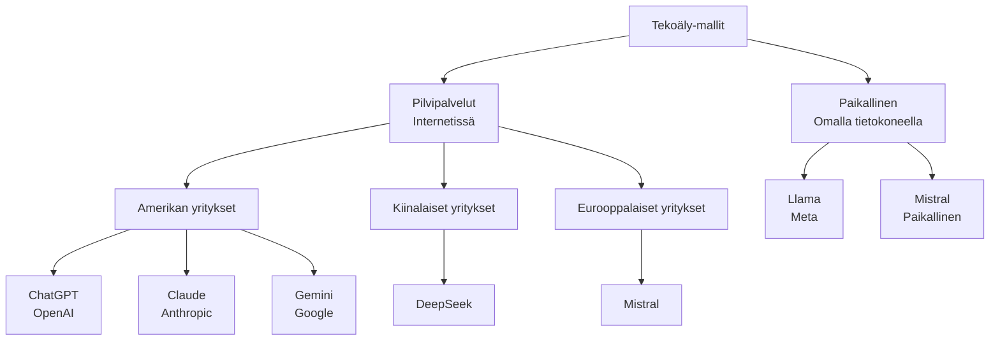

# Muita tekoälymalleja — kuin ChatGPT ja Claude

## Johdanto: Tekoälymaailma on isompi kuin näyttää

Olet ehkä kokeillut ChatGPTä tai Claudea. Ne ovat tunnettuja ja hyviä, mutta ne eivät ole ainoat! Maailmassa on monia muita tekoälymalleja, joilla on omat vahvuudet ja heikkoudet. Jokaisella on eri yritys takana, eri hinta ja eri tietosuojakäytännöt.

Miksi tämä kannattaa tietää? Koska eri tilanteet vaativat erilaisia ratkaisuja. Joskus halvin malli on paras, joskus nopein, joskus se, joka on turvallisesti Suomessa. Ammattilaisesti sinun pitäisi tuntea vaihtoehdot, jotta voit valita oikean tekoälytyökalun oikean tehtävän tekemiseen.

Tässä materiaalissa opettelemme yhdessä, mitä malleja on olemassa ja miten niitä verrataan toisiinsa.

## Osa 1: Googlen Gemini — Googlen tekoälymalli

Google on tehnyt oman tekoälymallinsa, jota kutsutaan Gemini:ksi. Se kilpailee ChatGPT:n ja Clauden kanssa. Monelle ihmiselle Gemini on hyvä vaihtoehto, koska sillä on joitakin ominaisuuksia, joita ChatGPT ei ole niin hyvä tekemään.

### Gemini: erilaiset versiot

Google tekee Geminista eri versioita, kuten autotehtaat tekevät eri automalleista:

Geministä on saatavilla Gemini Flash, joka on nopea versio ja hyvä nopeisiin tehtäviin, sekä Gemini Pro, joka on keskitason versio tasapainolla nopeuden ja kyvykkyyden välillä.

Kumpi on parempi? Riippuu siitä, mitä haluat tehdä. Nopeus vai tarkkuus.

### Miten Geminiin pääsee

Google tarjoaa **Google AI Studion**, joka on ilmainen verkkosivusto. Avaat selaimen, kirjaudut Googlen tilillä (kuten Gmailissa), ja voit heti alkaa kirjoittamaan tekoälylle. Sinulla on ilmainen kulurahaa joka kuukausi, jonka jälkeen kutsut ovat maksullisia. Mutta alkuun sen kanssa saat paljon kokeilla ilmaiseksi.

### Miten Gemini eroaa ChatGPT:stä

**Vahvuudet:**

Gemini osaa käsitellä kuvia yhtä hyvin kuin tekstiä. Jos otat kuvan tai näyttökuvan, voit näyttää sen Geminille ja kysyä "mitä tässä on?". Claude ja ChatGPT osaavat tätäkin, mutta Gemini on vahva omassaan. Lisäksi Gemini on sulautettu Googlen palveluihin — jos käytät Gmail-sähköpostia tai Google Drive -pilvipalvelua, Gemini on jo siellä saatavilla.

Gemini on myös edullisempi kuin ChatGPT. Jos vertaat hintoja: Googlen hinta on noin kymmenesosa OpenAI:n hinnasta.

**Heikkoudet:**

Googlella on tiukemmat säännöt siitä, mitä saa kysyä. Joskus Gemini sanoo "En voi vastata tähän" useammin kuin Claude tai ChatGPT. Lisäksi Claude ja ChatGPT ovat parempia ohjelmoinnissa, koska ne tuottavat parempaa koodia kuin Gemini.

> **Pohdi hetkeksi:** Mitä sinä tekisit tekoälyllä? Jos sinulla olisi kuvia, joista haluat tietoa, olisiko Gemini sinulle hyvä? Vai haluaisitko parempaa koodia, jolloin Claude olisi parempi?

## Osa 2: Kiinalaiset mallit — DeepSeek

Kiina on kehittänyt omia tekoälymalleja, ja niistä tunnetuin on DeepSeek. Siihen kannattaa tutustua, mutta tärkeät seikat pitää tietää.

### DeepSeek: halpa malli Kiinasta

DeepSeek on kiinalainen yritys, joka tekee tekoälymallia. Se on ilmainen tai erittäin halpa käyttää, ja monissa testeissä se on yhtä hyvä tai jopa parempi kuin ChatGPT ja Claude.

**Hyvät puolet:**

DeepSeek on hyvin halpa, käytännössä ilmainen pieniksi kuluiksi. Se on myös nopea ja hyvä ohjelmoinnissa. Jos sinulla on tiukka budjetti ja haluat käyttää tekoälyä paljon, DeepSeek on houkutteleva.

**Tärkeä ongelma: tietosuoja**

Mutta tässä on suuri "mutta". DeepSeek on kiinalainen palvelu ja kun lähetät tekstejä DeepSeekille, ne menevät Kiinan palvelimille. Kiinan hallituksella on lainsäädännön mukaan pääsy näihin tietoihin.

EU:ssa (ja Suomessa) on säännöksiä nimeltään GDPR, joilla suojataan henkilötietoja. GDPR sanoo, että henkilötiedot on säilytettävä EU:n alueella, ei ulkomailla. Kiinan palvelimilla tiedot eivät ole riittävän suojassa EU:n näkökulmasta.

Käytännössä tämä tarkoittaa:
- Jos olet opettaja ja käytät DeepSeekia oppilaiden esseiden analysoinnissa, se saattaa rikkoa säädöksiä
- Jos olet sairaala ja käytät sitä potilastietojen kanssa, se on kiellettyä
- Jos olet yritys ja käytät sitä asiakastietojen kanssa, se saattaa olla kiellettyä

**Johtopäätös:** DeepSeek on teknisesti hyvä ja halpa, mutta tietosuoja estää sen käytön monissa tilanteissa Suomessa ja EU:ssa.

> **Pohdi hetkeksi:** Kuvittele, että olet opettaja. Haluat käyttää tekoälyä oppilaiden esseiden arviointiin nopeasti. DeepSeek on halvin vaihtoehto. Mutta oppilaiden nimet ja esseiden sisältö menisivät Kiinan palvelimille. Olisiko se ok? Miksi tai miksi ei?

## Osa 3: Avoimet mallit — omalla tietokoneella ajettavat mallit

Toinen vaihtoehto on käyttää "avoimia malleja". Tämä ei tarkoita "ilmaisia", vaan "sinulla on koodi ja painot, voit ladata ja ajaa itse omalla tietokoneella".

### Meta Llama — tunnetuin avoin malli

Meta (entinen Facebook) julkaisi mallin nimeltään Llama. Se on ilmainen ladata, ja sinä voit ajaa sitä omalla tietokoneellasi. Llama on kilpailukykyinen ChatGPT:n ja Clauden kanssa.

**Mitkä ovat hyvät puolet:**

Kun ajat Llama-mallia omalla tietokoneella, tiedot pysyvät täysin sinulla. Mitään ei lähde internetiin ja kukaan ei näe, mitä kirjoitat. Tämä on täydellinen yksityisyys. Lisäksi, kun olet ladannut mallin kerran, se on ilmaista käyttää niin paljon kuin haluat, etkä maksa per kysymys kuten ChatGPT:n kanssa.

**Mitkä ovat huonot puolet:**

Omalla tietokoneella ajettava malli vaatii hyvää tietokonetta. Jos sinulla on vanha kannettava, se voi olla liian hidas tai se ei mahdu muistiin. Lisäksi vastaukset ovat hitaampia kuin pilvipalvelussa, koska pilvipalveluilla on valtavia laskentakoneita, kun sinulla kotona on pienemmät resurssit.

### Mistral — pienemmän kehittäjän valinta

Ranskalainen yritys Mistral tekee pienempää mallia, joka on helpompi ajaa omalla tietokoneella. Se on käyttäjäystävällisyyden osalta helpommin lähestyttävä kuin Llama.

### Millä ladata ja ajaa malleja omalla tietokoneella

On ohjelmia, jotka tekevät paikallisen ajamisen helppoksi.

**Ollama** on ohjelma, joka tekee ajamisesta helppoa. Asennat sen, valitset, minkä mallin haluat (esim. Llama), ja sitten voit käyttää sitä.

**LM Studio** on ohjelma, joka näyttää ChatGPT:n kaltaiselta — siinä on chat-ikkuna, ja voit kirjoittaa siihen. Se on helpompaa kuin komentorivi, jos et ole tottunut teknisiin asioihin.

### Miksi joku valitsisi paikallisen mallin?

Kolme pääsyytä:

**Yksityisyys:** Kaikki pysyy sinulla. Kukaan hallitus, yritys tai hakkeri ei näe, mitä kysyt.

**Raha:** Ensimmäisen latauksen jälkeen se on ilmaista. Et maksa per kysymys.

**Kontrolli:** Sinulla on mallin koodi. Voit muuttaa sitä, kehittää sitä, käyttää sitä kuten haluat.

Haittapuolia ovat nopeus (hitaampi) ja laitteiston tarve (tarvitset hyvän koneen). Mutta joillekkin näistä seikoista on tärkeä, joten he valitsevat paikallisen mallin.

> **Pohdi hetkeksi:** Mitä sinulle on tärkeää? Nopeus, hinta, yksityisyys, vai helppo käyttö? Eri mallit sopivat eri prioriteeteille.

## Osa 4: Mallien vertailu — miten valita?

Nyt tiedät, että malleja on monta. Miten siis valita?

Valinta ei ole "kumpi on parempi", vaan "kumpi sopii sinun tilanteeseen". Riippuu neljästä asiasta:

**1. Mitä haluat tehdä?** Koodin kirjoitus? Tekstin parantaminen? Kuvan analysointi? Eri mallit ovat hyviä eri asioissa.

**2. Kuinka paljon raha?** Jotkut ovat ilmaisia, jotkut kalliita, jotkut ilmaisia pienille käyttäjille ja kalliita suurille.

**3. Tietosuoja:** Missä haluaisit tietojen olevan? Omalla tietokoneella? Euroopan palvelimilla? Vai et välitä?

**4. Nopeus ja helppous:** Haluatko nopeaa tulosta vai voit odottaa vähän?

## Osa 5: Tietosuoja — missä tiedot menevät?

Tämä on tärkein osa. Kun käytät tekoälypalvelua internetissä, tekstit lähetetään palvelun palvelimille. Nuo palvelimet voivat olla eri puolilla maailmaa, ja niiden säännöt ovat erilaiset.

### Missä palvelimet sijaitsevat?

| Malli | Yritys | Palvelimet | Mitä pitää tietää |
|-------|---------|-----------|------------------|
| ChatGPT | OpenAI | USA | USA-laissa hallitus voi vaatia tietoja. Yleensä turvallinen, mutta amerikkalainen laki pätee. |
| Claude | Anthropic | USA | Kuten ChatGPT. Yritys yrittää noudattaa GDPR:ää. |
| Gemini | Google | USA ja Eurooppa | Google sallii palvelinten olevan EU:ssa. Turvallisempi EU:ssa. |
| DeepSeek | DeepSeek | Kiina | Kiinalaiset palvelimet. Kiinan hallitus voi vaatia tietoja. Ongelma EU:ssa. |
| Llama (omalla koneella) | Sinä | Sinun tietokoneesi | 100% yksityinen. Tiedot eivät lähde kotoa. |
| Mistral | Mistral | Eurooppa | Euroopan palvelimet. Noudattaa EU:n sääntöjä. |

### GDPR — Euroopan tietosuojalaki

Euroopan Unionissa on laki nimeltään GDPR. Se sanoo: jos otat talteen ihmisen tietoja (nimi, sähköposti, arkaluontoiset asiat), tiedot on oltava EU:n alueella tai maissa, joihin EU luottaa.

Kiina ei ole sellaisessa luotetussa listassa. Siksi, jos käytät DeepSeekia oppilaiden tai potilaiden tietojen kanssa, se rikkoo GDPR:ää.

Käytännössä:
- **Opettaja:** Et voi käyttää DeepSeekia oppilaiden esseiden analysoinnissa, koska oppilaiden tiedot ovat suojattuja.
- **Lääkäri:** Et voi käyttää DeepSeekia potilastietojen kanssa, koska potilastiedot ovat hyvin suojattuja.
- **Yritys:** Et voi käyttää DeepSeekia asiakastietojen kanssa, jos ne sisältävät henkilötietoja.

Mutta jos käytät DeepSeekia omiin harjoituksiin, joissa ei ole kenenkään tietoja, silloin se voi olla ok.

> **Pohdi hetkeksi:** Missä tekoälyä käyttävät ihmiset luonasi? Opettajat? Lääkärit? Johtajat? Mitä tietoja heille on sallittua lähettää tekoälylle? Entä mitä ei?

## Osa 6: Hinta ja käyttö — mitä maksaa?

Tässä on vertailu siitä, miten kallista eri mallien käyttäminen on. Hinnat muuttuvat, mutta nämä ovat suuntaa-antavia (2026):

| Malli | Yritys | Onko ilmainen? | Hinta | Tietosuoja | Nopeus |
|-------|---------|-----------|-------|-----------|--------|
| ChatGPT | OpenAI | Ei | Kallis | USA-palvelimet | Nopea |
| Claude | Anthropic | Ei | Kallis | USA-palvelimet | Nopea |
| Gemini | Google | Kyllä (rajoitetusti) | Halpa | EU-palvelimet saatavilla | Nopea |
| DeepSeek | DeepSeek | Kyllä (rajoitetusti) | Erittäin halpa | Kiina-palvelimet | Nopea |
| Llama (paikallinen) | Meta | Kyllä | Ilmainen | 100% yksityinen | Hidas |
| Mistral (paikallinen) | Mistral | Kyllä | Ilmainen | 100% yksityinen | Hidas |

**Mitä tämä tarkoittaa:**

Jos sinulla on pieni budjetti ja yksityisyys ei ole kriittistä, Gemini tai DeepSeek ovat halvoja. Jos yksityisyys on tärkeä ja sinulla on hyvä tietokone, paikallinen Llama tai Mistral ovat ilmaisia.

ChatGPT ja Claude ovat kalliimpia, mutta hyviä, jos organisaatiolla on budjetti.

> **Pohdi hetkeksi:** Sinulla on 500 euron vuosibudjetti. Mitä valitsisit? Entä jos yksityisyys on sinulle tärkeää?

## Kohti omaa projektia

Tällä tunnilla tutustuit laajempaan tekoälykenttään — Geminiin, DeepSeekiin, Llamaan ja Mistraliin. Jokainen malli on rakennettu eri tarpeeseen, ja jokaisella on omat vahvuutensa hinnan, yksityisyyden ja integraatioiden suhteen. Tämä ymmärrys auttaa sinua perustelemaan, miksi valitsit juuri tietyn alustan omalle botillesi. Kun rakennat bottia myöhemmillä tunneilla, muista: valinta ei ole vain "mikä on paras", vaan "mikä sopii parhaiten tähän käyttötilanteeseen". Se on ammattilaisen ajattelutapa.

## Osa 7: Yhteenveto

**Mitä olemme oppineet:**

1. **Malleja on monta, ne ovat erilaisia.** ChatGPT ja Claude eivät ole ainoat, Gemini, DeepSeek, Llama ja muut ovat vaihtoehtoja.

2. **Jokaisella on eri vahvuudet.** Gemini on halpa ja integroitu Googleen. DeepSeek on erittäin halpa, mutta tietosuoja-ongelma EU:ssa. Llama ja Mistral ovat yksityisiä, jos ajat niitä omalla koneella.

3. **Tietosuoja on tärkeä.** Tiedä, mihin palvelimille tiedot menevät. Oppilaiden tiedot, potilastiedot ja arkaluontoiset tiedot vaativat erityistä huolimista.

4. **Valinta riippuu tilanteesta.** Ei ole yhtä "parasta" mallia, vaan hinta, nopeus, yksityisyys ja käytettävyys ovat kaikki tärkeitä eri tilanteissa.

5. **Ammattilaisesti sinun pitäisi tuntea vaihtoehdot.** Seuraavalla työpaikalla voi olla sääntöjä, mitä malleja saa käyttää. Nyt tiedät, mistä puhutaan.

**Seuraavaksi:** Opimme, kuinka tehdä tekoälylle tarkkoja käskyjä. Kun tiedät, mitä malleja on olemassa, opimme, miten ne saavat vastauksen juuri sellaisena kuin haluat.
