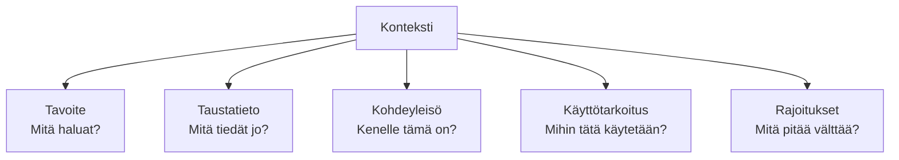
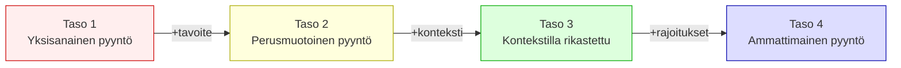
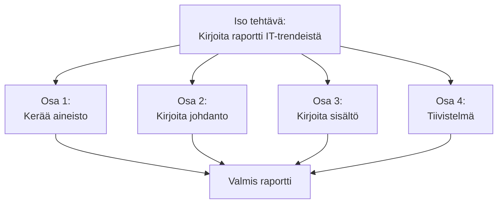
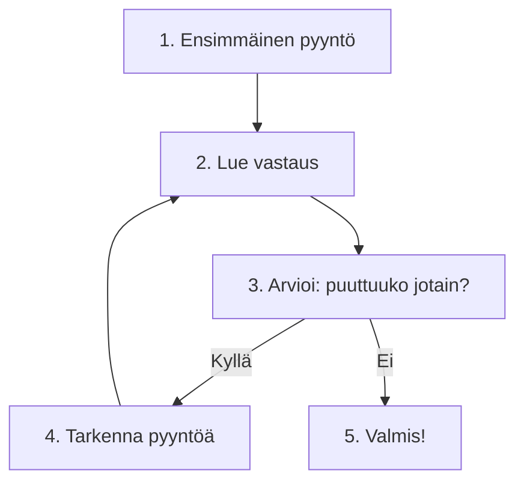

# Anna konteksti — rakenna oma promptauspankkisi

## Johdanto: Sama kysymys, aivan eri vastaukset

Kuvittele tilannetta. Sinulla on esseen aihe "Tekoäly työssä" ja pyydit tekoälyä auttamaan. Ensimmäisellä kerralla kirjoitat: "Kerro tekoälystä." Vastaus on yleinen eikä auta paljoa. Toinen yritys: "Kerro tekoälystä esseeseeni, jonka kohdeyleisö on IT-opiskelijat." Vastaus on parempi. Kolmas yritys: "Kirjoita 500 sanan johdanto esseeseeni, jonka aihe on 'Tekoäly työssä'. Kohdeyleisö: IT-opiskelijat, jotka eivät osaa koodia. Aloita sillä, miten tekoäly muuttaa jokapäiväisiä töitä."

Jokainen kierros antaa tekoälylle lisää kontekstia ja jokainen saa paremman vastauksen. Tämä ei ole magia. Se on pelkkää järkevää viestintää: mitä enemmän kerrot, mitä tarvitset, sitä paremman vastauksen saat.

Konteksti tarkoittaa kaikkea tietoa, jonka tekoäly tarvitsee ymmärtääkseen *sinun* tilanteesi. Ei kysymystä yleisesti, vaan *sinun* kysymystäsi, *sinulla*, *sinun* tavoitteillasi. Tämä oppitunti opettaa sinulle, miten rakentaa kontekstia käytännössä. Se on tämän kurssin tärkein taita.

## Konteksti: Miksi se on tärkeää

Konteksti on kaikkea tietoa, jota tekoäly tarvitsee sinusta ja tilanteestasi. Mitä haluat tehdä ja miksi? Kuka olet ja mikä on taustasi? Mihin käytät vastausta? Ketkä lukevat tai käyttävät sitä? Mitä muuta on tärkeää tietää? Nämä kaikki asiat muodostavat kontekstisi.

Esimerkki: "Kirjoita dokumentaatio funktiolle" on kysymys. Mutta sen vastaus voi olla hyvin erilainen riippuen kontekstista. Funktio voidaan dokumentoida koodarille, jolloin dokumentointi on tekninen, sisältää alaviitta ja yksityiskohtia. Se voidaan dokumentoida opiskelijalle, jolloin dokumentointi on opettavainen ja selittää vaihe vaiheelta. Se voidaan dokumentoida käyttäjälle, jolloin dokumentointi on yksinkertainen eikä sisällä teknistä jargonia.

Ilman kontekstia tekoäly tekee oletuksia ja arvailee. Kontekstin kanssa — esimerkiksi "dokumentaatio on 15-vuotiaalle opiskelijalle, joka ei osaa koodia, haluan, että hän ymmärtää, miten funktio toimii" — tekoäly osaa kirjoittaa sopivalla tasolla.

> **Pysähdy hetkeksi:** Ajattele viimeisintä kertaa, kun käytit tekoälyä. Annoitko sille riittävästi kontekstia? Mitä muuta olisit voinut kertoa, vaikka se olisi tuntuneet selvältä?

Konteksti on tärkeää neljällä tavalla. Ensinnäkin **spesifisyys**: jäsennelty, kohdistettu vastaus on parempi kuin yleinen. "Tekoäly työssä" voi tarkoittaa mitä tahansa, mutta "Tekoäly IT-opiskelijoiden arjessa" on tarkempi ja parempi vastaus. Toiseksi **sopiva taso**: Konteksti kertoo, mihin tasoon kirjoittaa. "Selitä tekoäly" on epäselvä, mutta "Selitä tekoäly 15-vuotiaalle, joka ei osaa ohjelmointia" on selkeä. Kolmanneksi **käyttökelpoinen muoto**: Konteksti kertoo, mitä teet vastauksella. "Auta minua esseen kirjoittamisessa" on eri kuin "auta minua koodiprojektissa" — vastauksen muoto muuttuu. Neljänneksi **oikea sisältö**: Konteksti vähentää tarpeettomia iteraatioita. Jos kerrot alusta alkaen, mitä tarvitset, tekoäly osaa antaa sen heti — eikä tarvitse pyytää tarkennuksia.

## Kuinka antaa kontekstia: Käytännön esimerkki

Vertaa näitä kolmea pyyntöä:

**Huono pyyntö:**
"Auta minua historian esseen kanssa."

**Parempi pyyntö:**
"Kirjoita johdanto historian esseeseeni. Aihe on 'Digitaalinen vallankumous'. Luokka: 10-vuotiaat opiskelijat."

**Paras pyyntö:**
"Kirjoita 200 sanan johdanto historian esseeseeni. Aihe: 'Digitaalinen vallankumous'. Luokka: 10-vuotiaat IT-opiskelijat, joilla on perustiedot historiasta, mutta ei erityistä tekniikan tietoa. Haluan, että lukija ymmärtää, miksi tämä aihe on tärkeä. Johdanto päättyy aiheväitteeseen."

Kolmannessa pyynnössä kerrot mitä haluat: johdanto, pituuden (200 sanaa), aiheen (digitaalinen vallankumous), kohdeyleisön (10-vuotiaat opiskelijat), heidän taustansa (IT-koulutus, historia, ei tekniikan osaamista), tarkoituksen (tehdä aihe tärkeäksi) ja lopputuloksen (johdanto päättyy väitteeseen).

Nyt tekoäly ymmärtää oikein, mitä sinä tarvitset.

> **Pysähdy hetkeksi:** Mitä kontekstia olisit antanut edellisen pyynnön yhteydessä? Mitä jäi puuttumaan?

## Lähdeaineiston antaminen: Tekstit, koodit, dokumentit

Usein sinulla on olemassa olevia aineistoja, joita haluat tekoälyn käsittelevän. Esimerkiksi artikkeli, jonka haluat yksinkertaistaa opiskelijoille, tai koodi, jossa on bugi. Ammattilaisesti et pyydä tekoälyä "selittämään jotain, mitä et ole sille antanut" — annat ensin materiaalin ja sitten kehotuksen.

Esimerkki 1: Sinulla on tiede-artikkeli kvantummekaniikasta, jonka haluat yksinkertaistaa 15-vuotiaalle. Voit kopioida artikkelinpätkän tai otsikon ja sanoa: "Tässä on teksti kvantummekaniikasta. Kirjoita se uudelleen 15-vuotiaalle ymmärrykselle sopivaksi. Käytä esimerkkejä jokapäiväisestä elämästä." Vaihtoehtoisesti voit antaa pääkohdat ja sanoa: "Artikkeli käsittelee kvantummekaniikkaa. Pääkohdat: elektronit voivat olla useissa paikoissa samanaikaisesti, mittaaminen vaikuttaa tulokseen. Selitä nämä kahdessa lauseessa 15-vuotiaalle."

Esimerkki 2: Sinulla on ryhmän tekemä ryhmätyön raportti, jota haluat parantaa. Annat sen ja sanot: "Tässä on ryhmän raportti. Parantele sitä seuraavissa asioissa: 1) Johdanto ei selitä aiheita riittävästi, 2) johtopäätökset ovat liian lyhyet, 3) lähdeviitteet puuttuvat."

Tärkeä periaate on tämä: **Anna ensin aineisto, sitten kehotus.** Tekoäly näkee konkreettisen tekstin ja voi antaa spesifisen, siihen perustuvan vastauksen. Sen ei tarvitse arvailla.

> **Pysähdy hetkeksi:** Missä opiskelun tilanteissa sinulla on olemassa olevia aineistoja, joita haluat tekoälyn käsittelevän? Esimerkiksi artikkelit tenttiin, muiden kirjoittama koodi, vertaisarviointi?

## Tehtävän pilkkominen: Iso ongelma, pienemmät osat

Ammattilaisesti tärkeä taita on **pilkkominen**. Kun sinulla on iso, monimutkainen tehtävä, et pyydä tekoälyä "ratkaisemaan sitä", vaan jaat sen pienempiin osiin, joista jokainen on hallittava.

Esimerkki: "Kirjoita raportti, jossa vertaillaan kolmea eri menetelmää data-analyysiin ja sisällytetään omat tulkinnat sekä johtopäätökset." Se on iso tehtävä. Pilko se näin:

Ensin voit pyytää tekoälyä: "Kirjoita yhteenveto data-analyysin perusteista — mitä se on?" Sitten: "Kuvaile kolme menetelmää ja niiden perusidea — yksi lause kustakin." Seuraavaksi: "Nyt lisää vertailu: mitkä ovat kunkin menetelmän edut ja haitat?" Sitten: "Kuinka nämä sopivat opiskelijan projektiin?" Lopuksi: "Kirjoita johtopäätös — mitä opit?"

Jokainen osio on pienempi ja tekoäly antaa parempia vastauksia pienempiin osiin. Kun olet saanut kaikki osat, voit yhdistää ne kokonaiseksi raportiksi.

Ammattilaisesti pilkkominen säästää aikaa, koska vastaukset ovat tarkempia. Jokainen osa on kohdistettu yhteen asiaan eikä tekoäly sekoita asioita.

> **Pysähdy hetkeksi:** Mitkä ovat etuja, kun pilkot ongelman osiin tekoälylle? Mitä riskejä on, jos et pilko?

## Iteraatio ja tarkentaminen: Kierros kerrallaan parempi vastaus

Kun tekoäly antaa ensimmäisen vastauksen, se on usein vain pohja. Ammattilaisesti seuraavat kierrokset terävöittävät sitä.

Esimerkki: Haluat oppia Python-ohjelmoinnista tenttiin. Kierros 1: "Kerro Python-muuttujista." — Saat perustiedot. Kierros 2: "Lisää esimerkkejä muuttujista. Näytä, miten nimetään oikein ja miksi se on tärkeää." — Saat enemmän esimerkkejä. Kierros 3: "Nyt lisää yleisiä virheitä. Mitä väärää muuttujien kanssa voi tehdä?" — Saat edge-caseita. Kierros 4: "Lopuksi tee minulle harjoitustehtävät — 5 kysymystä, joista opiskelijat saattaisivat vastailla väärin." — Saat testitehtävät.

Jokainen kierros rakentuu edellisen päälle. Ammattilaisesti tämä on tehokas lähestymistapa: olet täydentänyt ratkaisua vaihe vaiheelta ilman, että etsit kokonaan uutta vastausta joka kierroksella.

Tärkeä periaate on tämä: **Jatkoprompti on tarkempi kuin perusprompti.** Et kirjoita "nyt paranna sitä yleisesti" vaan "lisää nämä kolme asiaa: X, Y, Z". Spesifikaatio johtaa parempiin tuloksiin.

> **Pysähdy hetkeksi:** Milloin oppimisessasi olisi hyödyllistä käyttää iteraatiota? Esimerkiksi tenttiin valmistautuminen, ryhmätyön tekeminen, esseen kirjoittaminen?

## Kontekstin rakentaminen: Käytännön esimerkki

Katsotaan koko prosessia yhden tapauksen kautta alusta loppuun.

**Tehtävä: Haluat tekoälyn auttavan sinua valmistautumaan IT-perusteita koskevan luennon tenttiin.**

**Kierros 1 — Yksinkertainen kysymys:**

Pyyntö: "Opettele minulle tenttiin valmistautumisesta." Tulos: yleinen ohjeistus, ei spesifinen sinulle.

**Kierros 2 — Lisää kontekstia:**

Pyyntö: "Tentti on IT-perusteista. Aiheita: verkot, palvelimet, tietoturva. Minulla on 1 viikko aikaa. Opetan parhaiten esimerkeistä." Tulos: parempi, mutta vielä liian yleinen.

**Kierros 3 — Vielä tarkempaa:**

Pyyntö: "Tentti on IT-perusteista (verkot, palvelimet, tietoturva). Minulla on 1 viikko. Opetan parhaiten esimerkeistä todellisesta maailmasta. Haluan viikko-ohjelman, jossa joka päivälle on 30 minuutin opiskelusessio. Jokainen sessio: aihe, 2–3 konkreettista esimerkkiä, testikysymys." Tulos: spesifinen viikko-ohjelma, joka sopii sinulle.

**Kierros 4 — Pilko osiin:**

Pyyntö: "Aloitetaan maanantaista. Aihe: perustiedot verkoista. Mitä olennaista opiskelijan pitäisi tietää? Anna 3 konkreettista esimerkkiä — miten verkot toimivat jokapäiväisessä elämässä." Tulos: fokussoitu maanantain sessio.

Koko prosessi rakentui kontekstin avulla kierros kierrokselta. Sinulla oli spesifinen, käyttökelpoinen opiskelusuunnitelma, joka sopi sinulle — eikä yleinen lista.

## Kohti omaa projektia

Kontekstin rakentaminen on juuri se taito, joka tekee tekoälystä työkalun. Tällä tunnilla harjoittelit, miten taustatiedot, jatkokysymykset ja iteraatio parantavat tekoälyn vastauksia. Tehtävissä rakennat itsellesi **promptauspankin** (Rakennuspalikka 1) — kokoelman 5–7 omaa, testattua promptia, joita voit käyttää uudelleen. Tämä pankki on bottisi tulevan järjestelmäpromptin raaka-aine: kun tunnilla 17 kirjoitat botille pääohjeen, otat siihen toimivat rakenteet suoraan tästä pankista. Seuraavaksi suunnittelet, kenelle bottisi on ja mitä se tekee.

## Yhteenveto: Konteksti on ammattimainen taito

Ammattilaisesti kontekstin rakentaminen on tämä prosessi:

Aloita selkeällä tavoitteella: Mitä haluat tehdä? Yksinkertainen, spesifinen kysymys. Sitten anna taustatiedot: Mikä on sinun tilannetta? Mitä tarvitset? Kuka olet? Konteksti rakentuu. Jaa isot tehtävät: Jaa ne pienempiin osiin, joista jokainen on hallittava. Liitä olemassa oleva aineisto: Tekstit, koodit, asiakirjat — anna ne tekoälyn nähtäväksi. Iteroi ja terävöi: Jatkokysymykset tekevät vastauksesta paremman, spesifisemmän ja käyttökelpoisemman. Testaa ja validoi: Jokaisen kierroksen jälkeen tarkista, että vastaus auttaa sinua oppimisessasi.

Tämä prosessi vaatii enemmän aikaa ensimmäisen pyynnön laatimiseen ja vähemmän iteraatioita myöhemmin. Ammattilaisesti se on parempi investointi. Seuraavalla tunnilla harjoitellaan tätä käytännössä oikeissa opiskelun tehtävissä.
