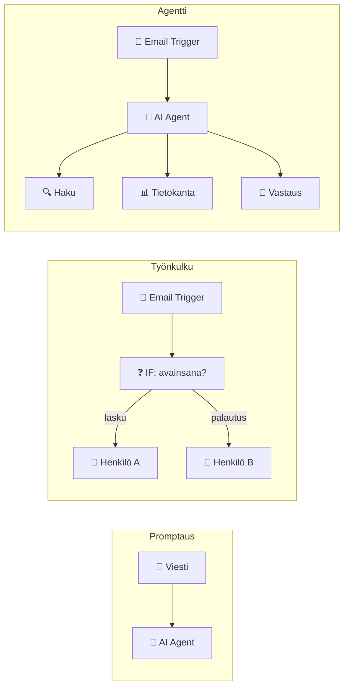

# Automaatio vai autonomia? — milloin agentti kannattaa

## Johdanto

Nyt kun tiedät, mikä agentti on, seuraava kysymys on ilmeinen: milloin sinun pitäisi käyttää agenttia? Vastaus ei ole "aina". Agentti tuo mukanaan monimutkaisuutta, kustannuksia ja riskejä. Tavallinen työnkulku tai jopa yksinkertainen promptaus voivat riittää.

Kun oppitunneilla rakennat omaa agenttia n8n:llä, tämän osaaminen auttaa sinua tekemään parempia arkkitehtuuripäätöksiä. Tietäessäsi, milloin agentti todella kannattaa, voit suunnitella projektin järkevästi.

Kuvittele, että hallinnoit IT-tukiosastoa. Joka päivä tulee 50 tukipyyntöä. Joku ehdottaa: "Tehdään agentti, joka käsittelee nämä automaattisesti!" Kuulostaa hyvältä, kunnes ymmärrät todellisuuden: agentin rakentaminen, testaaminen ja ylläpito kestävät kuukauden ja maksavat 10 000 euroa. Ehkä yksinkertainen työnkulku, joka ohjaa tiketit oikealle henkilölle automaattisesti, antaisi saman hyödyn murto-osalla kustannuksista?

Tässä oppitunnissa opit **päätöspuuta** — järjestelmää, joka auttaa sinua valitsemaan oikean ratkaisun. Milloin promptaus riittää? Milloin tarvitset työnkulun? Milloin agentti todella kannattaa rakentaa?

**Pysähdy hetkeksi:** Ajattele omaa tulevaa työtäsi. Mitä toistuvia, monivaiheisia tehtäviä näet? Mitkä niistä voivat olla työnkulkuja, ja mitkä vaatisivat agentin?

## Kolmen tason kustannukset ja hyödyt

Automatisoinnissa on kolme perusvälinettä, ja jokainen tuo mukanaan eri kustannukset ja hyödyt. Kun päätät, mitä rakentaa, sinun täytyy ymmärtää, mitä jokainen väline todellisuudessa maksaa ja mitä se antaa.

Ensimmäinen väline on **yksinkertainen promptaus**. Käyttäjä kirjoittaa ChatGPT:lle kysymyksen, ja se vastaa. Käyttäjä omistaa prosessin alusta loppuun. Kustannus on pieni — pääasiassa käyttäjän aika ja ChatGPT-tilaus. Hyöty? Nopea, helppo, ei ylläpitoa. Rajoitus: käyttäjän täytyy aloittaa prosessi itse. Jos sähköpostiviestit vaativat yhteenvetoja, jonkun täytyy manuaalisesti kopioida ne ChatGPT:hin ja odottaa vastausta.

Toinen väline on **työnkulku** (workflow). Kun sähköposti saapuu asiakaspalveluun, automaattinen työnkulku tarkistaa, mitä avainsanoja viesti sisältää. Sisältääkö se sanan "lasku"? Ohjaa henkilölle A. Sisältääkö se sanan "palautus"? Ohjaa henkilölle B. Ei sisällä mitään näistä? Jää saapuneisiin. Työnkulku tekee nämä päätökset **joka kerta** ilman ihmisen osallistumista. Kustannuksiltaan se on enemmän kuin promptaus — sinun täytyy suunnitella, kuinka logiikka toimii, testata se ja ylläpitää sitä, kun avainsanat muuttuvat. Mutta hyöty on merkittävä: ihmiset säästävät aikaa päivittäin, ja prosessi on johdonmukainen. Rajoitus: säännöt ovat jäykkiä. Jos uusi tilanne ei sovi etukäteen kirjoitettuihin sääntöihin, työnkulku jumittuu.

Kolmas väline on **agentti**. Sama asiakaspalvelun agentti lukee sähköpostia, analysoi sen tunnelmaa, etsii vastaavia aiempia tapauksia tietokannasta ja **päättää** — ei seuraa sääntöjä, vaan tekee omaa arviota — onko se tarpeeksi luottavainen lähettääkseen automaattisen vastauksen vai ohjatakseen viestin ihmiselle. Jos asiakas on vihainen, agentti käyttää erilaisempaa sävyä. Jos sama asiakastapaus tulee kahteen kertaan, agentti muistaa ensimmäisestä kerrasta ja käyttää oppimaansa tietoa. Kustannus? Suuri. Kehitys on monimutkaisempaa, koska logiikka on dynaamista. Testaus vie paljon aikaa, koska agentti voi tuottaa odottamattomia tuloksia. Ylläpito on jatkuvaa, koska sinun täytyy valvoa, mitä agentti oppii. Hyöty? Agentti hallitsee monimutkaisia, epätavallisia tapauksia, joita työnkulku ei osaa käsitellä. Rajoitus: korkea hinta tarkoittaa, että sinun täytyy saada merkittävä paluutuotto investoinnillesi.

**Pysähdy hetkeksi:** Miksi olet valmis maksamaan enemmän agentin rakentamisesta? Mitä etua se antaa, jota ei voi saavuttaa pelkällä työnkululla?

## Kuusi kysymystä päätösten tekemiseen

Kun tarkastelet automatisoitavaa tehtävää, kysy nämä kuusi kysymystä **järjestyksessä**. Ne auttavat sinua navigoimaan päätösvälineiden joukossa.

**Ensimmäinen kysymys: Toistuuko tehtävä?** Jos tehtävä on kertaluontoinen — teet sitä vain kerran tai hyvin harvoin — älä automatisoi lainkaan. Tekemisen aikaa säästät pienemmän määrän kuin automatisoinnin rakentamiseen kuluva aika. Mutta jos tehtävä toistuu joka päivä, joka tunti tai jopa sekunneissa, automatisointi alkaa kannattaa. Jopa yksinkertainen työnkulku voi säästää merkittävästi aikaa, kun sitä sovelletaan tuhansia kertoja vuodessa.

**Toinen kysymys: Onko tehtävä yksinkertainen vai monimutkainen?** Yksinkertaiset tehtävät — yksi tai kaksi vaihetta, selkeät säännöt, jotka eivät vaadi päättelyä — ratkeavat työnkululla. Esimerkiksi "Kun laskua ei ole vastaanotettu, siirrä se kansioon 'odottaa'" on niin suoraviivainen, että työnkulku on riittävä. Mutta monimutkaisten tehtävien kanssa asiaa on toisin. Jos tehtävä sisältää useita vaiheita, ehdollisia päätöksiä, oppimista ja mukautumista, työnkulun jäykät säännöt alkavat riittämättömiksi. Tämä on merkki siitä, että harkinta eli päättely — agentin sydän — voisi olla arvokas.

**Kolmas kysymys: Ovatko säännöt staattisia vai muuttuvia?** Staattisissa säännöissä — "joka kerta teemme täsmälleen saman" — työnkulku on täysin riittävä. Jokainen tapaus käsitellään identtisesti, ja uusia poikkeamia ei ilmene. Mutta muuttuvissa säännöissä — "jokainen asiakas on eri, opimme uusia malleja, tilanteet muuttuvat" — agentti on parempi valinta. Agentti voi oppia uusista malleista ja soveltaa oppimaansa seuraaviin tilanteisiin. Työnkulku ei voi tehdä sitä. Se tekee aina samaa, riippumatta siitä, mitä se on aiemmin nähnyt.

**Neljäs kysymys: Kuka maksaa hinnan?** Jos käyttäjä maksaa pienen summan, kuten ChatGPT-tilauksen, on helppo aloittaa ja riski on pieni. Mutta jos organisaatio maksaa tuhansia tai kymmeniä tuhansia euroja agentin rakentamisesta, päätös on paljon suurempi. Se vaatii merkittävää perustelua ja varmuutta siitä, että paluutuotto todella saavutetaan.

**Viides kysymys: Mitkä ovat epäonnistumisen kustannukset?** Jos agentti tekee virheen ja mitään vakavaa ei tapahdu — esimerkiksi sähköposti menee väärään kansioon, mutta ihminen näkee sen ja korjaa — riskin voi ottaa. Mutta jos kustannukset ovat suuret — raha menetetään, asiakkaita menetetään, ihminen loukkaantuu — agentin täytyy valvoa hyvin huolellisesti. Ja valvonta nostaa ylläpitokustannuksia merkittävästi. Joissain tapauksissa korkeat epäonnistumisen kustannukset tekevät agentin rakentamisen kannattamattomaksi.

**Kuudes kysymys: Onko ihmisen valvonta mahdollista?** Jos ihminen voi valvoa agentin päätöksiä ja puuttua siihen, kun se menee pieleen, riski on hallittavissa. Agentti voi pyytää ihmisen apua vaikeissa tilanteissa, mikä tekee riskien hallinnasta mahdollista. Mutta jos valvonta on mahdotonta — ehkä agentti tekee päätöksiä niin nopeasti, ettei ihmisellä ole aikaa reagoida — agentin täytyy olla lähes täydellinen. Se on harvinaisen kallista rakentaa.

## Käytännön päätöspuu kolmessa tarinassa

Katsotaan kolmea todellista tilannetta ja sitä, mitä kuusi kysymystä neuvovat.

**Tilanne yksi: Laskujen käsittely.** Yritys käsittelee 100 laskua päivässä. Lasku saapuu, sen summa täytyy vahvistaa ja kirjata järjestelmään. Säännöt muuttuvat jonkin verran — uusia laskuttajia tulee, hinnat muuttuvat — mutta prosessi pysyy samana. Entä epäonnistumisen hinta? Se on korkea. Väärä summa tarkoittaa, että organisaatio menettää rahaa. Mutta onneksi ihmisen valvonta on mahdollista — jonakin päivänä valvoja tarkistaa, että laskut käsiteltiin oikein. Vastaukseksi näille kuudelle kysymykselle tulee: tehtävä toistuu (kyllä), on monimutkainen (kyllä), säännöt hieman muuttuvia (kyllä), kustannukset organisaatiotasolla (kyllä), epäonnistumisen hinta korkea (kyllä), valvonta mahdollista (kyllä). Paras ratkaisu? **Työnkulku yhdessä ihmisen valvonnan kanssa**. Agentti olisi ylimitoitettu, ellei laskumäärä nouse radikaalisti.

**Tilanne kaksi: Sähköpostien lajittelu.** Sähköposteja tulee satoja päivässä, mutta tehtävä on yksinkertainen — kategoriointi sisältöjen perusteella. Hakusanat pysyvät samana vuodesta toiseen. Epäonnistumisen hinta? Matala. Jos sähköposti menee väärään kansioon, käyttäjä näkee sen ja siirtää sen itse — ei kriisi. Valvontaa ei tarvita. Vastaukseksi: tehtävä toistuu (kyllä), yksinkertainen (kyllä), säännöt staattisia (kyllä), kustannukset pienet (kyllä), epäonnistumisen hinta matala (kyllä), valvonta ei kriittinen (ei). Paras ratkaisu? **Yksinkertainen työnkulku**. Agentti olisi täysin ylimitoitettu ja turhan kallis.

**Tilanne kolme: Teknisen tuen tikettien reitittäminen.** Yritys saa yli 50 tukipyyntöä päivässä. Reititykseen vaikuttavat monet tekijät — tiketin prioriteetti, tekijän osaaminen, kiireellisyys ja asiakassuhteen arvo. Säännöt muuttuvat jatkuvasti, koska tekijät, tuetut ohjelmointikielet ja prioriteetit muuttuvat. Epäonnistumisen hinta on keskikorkea — väärä tekijä aiheuttaa asiakastyytyväisyyden heikkenemistä. Valvonta on mahdollista — supervisori tarkistaa päätökset. Vastaukseksi: tehtävä toistuu (kyllä), monimutkainen (kyllä), säännöt muuttuvia (kyllä), kustannukset merkittävät (kyllä), epäonnistumisen hinta keskikorkea (kyllä), valvonta mahdollista (kyllä). Paras ratkaisu? **Aloita työnkululla, valmistaudu agenttiin.** Jos yritys kasvaa ja tiketit monimutkaistuvat, voit siirtyä agenttiin, mutta älä aloita siellä.

**Pysähdy hetkeksi:** Käy läpi nämä kolme tilannetta ja ajattele omaa hypoteettista tehtävää. Mitä kuusi kysymystä vastaavat?

## Monimutkaisuus on aina kustannus

Tässä on kriittinen ajatus, jonka monet unohtavat: agentti on monimutkainen. Se ei ole vain "parempi työnkulku". Se on erilainen **luonteeltaan**, ei pelkästään mittakaavassaan.

Työnkulun kehitysaika on tunneissa tai päivissä. Agentin kehitysaika on viikoissa tai kuukausissa, koska dynaaminen logiikka vaatii paljon enemmän suunnittelua. Työnkulkua testaa tekijä, joka ymmärtää säännöt. Agenttia testataan laajemmin, koska sen dynaamisuus voi tuottaa odottamattomia tuloksia. Agentti vaatii jatkuvaa oppimisen valvontaa — jos agentti oppii virheistä, sinun täytyy seurata, mitä se on oppinut ja ovatko opittavat asiat halutunlaisia. Jos agentti alkaa tehdä systemaattisesti virheellisiä johtopäätöksiä, sinun täytyy puuttua siihen ja muuttaa sen ohjeistusta.

Eli: miksi rakennat agentin? Vastaus on yksinkertainen matemaattinen vertailu. Jos työnkulku ratkaisee ongelmasi 80 prosentissa tapauksista ja agentti ratkaisee sen 85 prosentissa tapauksista, oletko valmis maksamaan 10 kertaa suuremmat kehitys- ja ylläpitokustannukset tuosta 5 prosentin parannuksesta? Harvat ovat. Mutta jos työnkulku ratkaisee vain 40 prosenttia tapauksista ja agentti 95 prosenttia tapauksista, silloin hyöty on selvästi suurempi kuin kustannukset. Tällöin agentti kannattaa rakentaa.

## Miltä nämä päätökset näyttävät n8n:ssä?

Kun rakennat agenttia n8n:ssä, päätökset, joita tässä opettelit, muuttuvat konkreettisiksi valinnoiksi n8n:n visuaalisessa editorissa.

**Yksinkertainen promptaus** n8n:ssä: yksi "AI Agent" -solmu, joka saa viestin ja vastaa. Ei muita solmuja. Tämä riittää, kun tehtävä on yksinkertainen.

**Työnkulku** n8n:ssä: sarja solmuja, jotka seuraavat toisiaan. Esimerkiksi: "Email Trigger" → "IF-solmu" (tarkistaa avainsanan) → "Slack-solmu" (lähettää viestin oikealle kanavalle). Logiikka on kiinteä: sama syöte tuottaa aina saman tuloksen.

**Agentti** n8n:ssä: "AI Agent" -solmu, jolla on pääsy **työkaluihin** (tietokanta, verkkohaku, tiedostot). Agentti päättää itse, mitä työkalua käyttää. Tämä on monimutkaisempaa, mutta joustavampaa.

Tämä esikatselun tarkoitus on yksinkertainen: kun tulet oppitunnille 26 ja avaat n8n:n, tiedät jo, **mitä olet rakentamassa ja miksi**. Päätös promptaus vs. työnkulku vs. agentti on arkkitehtuuripäätös, ei työkalupäätös.

## Kohti omaa projektia

Kun valitsit oppitunnilla 19 oman agenttiongelmasi, tämän oppitunnin kuusi kysymystä auttavat sinua tarkistamaan, onko agentti todella oikea ratkaisu. Palaa päätöspuuhun ja käy ongelmasi läpi: toistuuko tehtävä, onko se tarpeeksi monimutkainen ja muuttuvatko säännöt tilanteen mukaan? Jos päätöspuu osoittaa, että yksinkertaisempi ratkaisu riittäisi, harkitse ongelman tarkentamista sellaiseksi, jossa agentin autonomisuus tuottaa aidosti lisäarvoa.

## Yhteenveto

Automatisointi on spektri, ei kaksijako. Älä hyppää agentin puoleen automaattisesti. Kysy ensin nämä kuusi kysymystä: Toistuuko? Monimutkainen? Muuttuvatko säännöt? Kuka maksaa? Mitkä ovat epäonnistumisen kustannukset? Onko valvonta mahdollista? Päätöspuu ohjaa sinut oikeaan välineeseen. Yksinkertainen työnkulku ratkaisee usein enemmän kuin agentti kymmenesosalla kustannuksista. Valitse aina yksinkertaisin ratkaisu, joka todella toimii.
