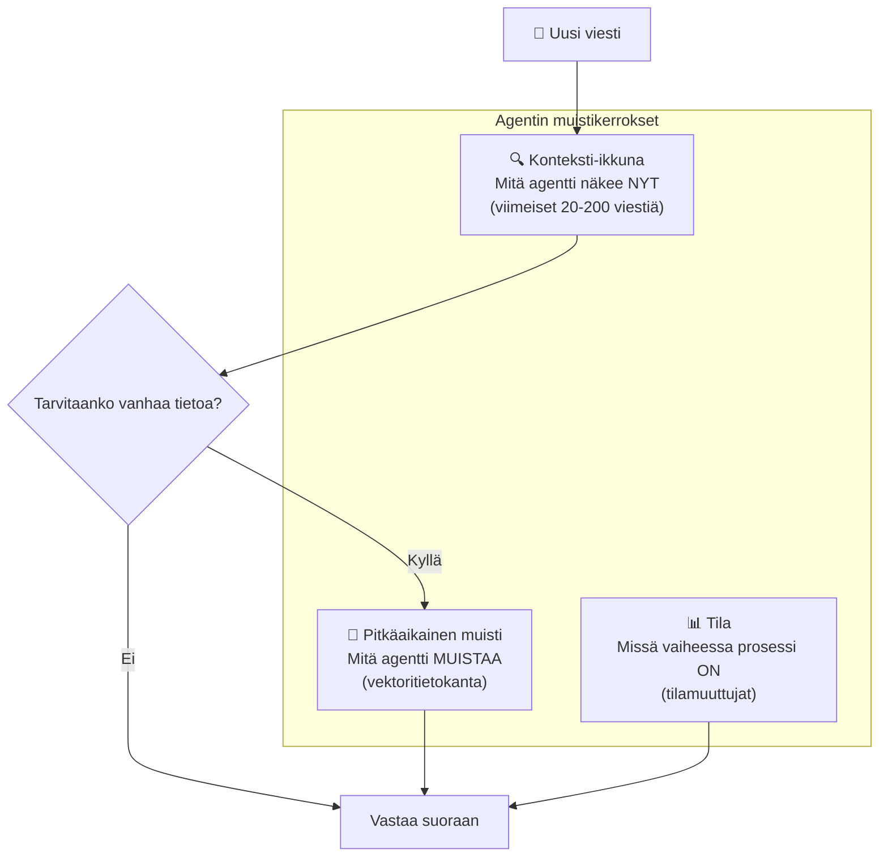
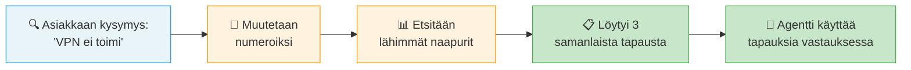

# Agentin muisti ja konteksti — miten kone pysyy kartalla

## Johdanto

Kun rakennat omaa agenttia n8n:llä, yksi suurimmista eroista edellisiin oppitunteihin verrattuna on tämä: agentti ei unohda. Se muistaa, mitä tapahtui viime viikolla. Se tietää, missä vaiheessa prosessi on. Se näkee asiakkaansa historian ja osaa käyttää sitä uuden ongelman ratkaisemisessa. Tämä muisti ja konteksti ovat agentin sydän — ilman niitä se olisi lähes käyttökelpoton, toistava ja epäintelligentti.

Omissa boteissa (joista oppitunneilla 21–22 puhutaan) muisti päättyy siihen, kun keskustelu loppuu. Mutta agentissa muisti jatkuu. Tässä oppitunnissa opit, **kuinka agentti näkee nykyisen tilanteen (konteksti-ikkuna), kuinka se muistaa menneisyyttä (pitkäaikainen muisti) ja kuinka se seuraa prosessin vaiheita (tila)**. Nämä kolme tekijää tekevät agentista näennäisesti älykkään. Ja kun rakennat agenttia n8n:llä, nämä kolme ovat ne rakennuspalkit, joista logiikkasi syntyvät.

## Konteksti-ikkuna: mitä agentti näkee juuri nyt

Kuvittele IT-tuen agenttia, joka vastaa asiakkaiden neljänkymmenen edellisen viestin jälkeen kysymykseen "Entä mitä ehdit tehdä?". Agentti lukee 40 viestiä ja yrittää muistaa, millä se aloitti. Se on sama kuin lukea 40 sivua kirjaa yhdessä istunnossa ja sitten kysyä kirjan ensimmäisen sivun asiasta. Aivot väsyvät. Agentti väsyy.

**Konteksti-ikkuna** on se osa keskustelusta, jonka agentti näkee kerralla. Se on kuten muistilaatikko, joka säilyttää vain viimeisimmät viestit. Jos ikkuna on 50 viestiä, ja sitten saapuu 51. viesti, vanhin poistuu näkyvistä. Tämä rajaaminen on **tarkoituksellinen suunnittelu**, ei puute — koska kaikilla järjestelmillä on rajat prosessointikyvyssään ja budjetissaan.

Käytännössä konteksti-ikkuna on kauppa: mitä suurempi ikkuna, sitä parempi muisti ja tarkempi ymmärrys tilanteesta. Mutta suurempi ikkuna tarkoittaa myös **enemmän dataa, joka täytyy käsitellä**, mikä tekee agentista hitaamman ja kalliimman. Jokainen sana, jonka agentti näkee, maksaa rahaa, jos käytät kaupallista LLM-palvelua kuten OpenAI:n API:a.

**Pysähdy hetkeksi: Kuvittele asiakaspalvelu-agenttia, joka käsittelee pitkiä tuen prosesseja. Asiakas alkaa kuvailemaan ongelmaa, ja 30 viestin jälkeen hän kysyy: "Nyt kun olet kuullut kaiken, mitä ehdotat?" Jos konteksti-ikkuna on vain 20 viestiä, agentti näkee enää vain viimeisen 20 — alkuperäinen ongelma on poissa näkyvistä. Mitä tapahtuu?**

Ammattilaisena sinun täytyy ymmärtää konteksti-ikkunan koko omissa agenteissasi. It-support-agentissa, joka käsittelee pitkiä dialogi­sarjoja, saatat haluta 100–200 viestin ikkunan, jotta historiaa säilyttää. Transaktio-agentissa, joka ratkaisee nopeita kyselyitä ("Mikä on hinta?"), 20–30 viestiä riittää. Järkevä valinta riippuu **siitä, mitä agentin täytyy muistaa tehtävää varten**.

## Pitkäaikainen muisti: vektoritietokanta merkityksen etsijänä

Konteksti-ikkuna kertoo agentille, mitä tapahtuu **nyt**. Mutta entä jos asiakkaan kanssa olette työskennelleet kuusi kuukautta? Entä jos hän palaa nyt uudella ongelmalla, ja haluat, että agentti muistaa, mitä opitte viimeksi?

Tätä varten on **pitkäaikainen muisti**, joka tallennetaan **vektoritietokantaan**. Tämä on erikoistunut tietokanta, joka ymmärtää *merkityksiä*, ei vain täsmällisiä sanoja. Se on isolla merkityksellinen ero.

Tavallisessa tietokannassa etsit täsmällisillä termeillä. "Muistikortti" löytyy vain, jos kirjoitat "muistikortti". Mutta vektoritietokannassa tieto tallennetaan merkityksen perusteella. Kun asiakas sanoo "Minulla oli ongelma muistilaatteen kanssa viime kuussa", se muunnetaan **matemaattiseksi koodiksi** — vektoriksi — joka edustaa lauseen merkitystä: "muistin liittyvä laite", "ongelma", "mennyt aika". Myöhemmin, kun sama asiakas tulee ja sanoo "Muisti-juttu oli vaikeaa", agentti muuntaa tämänkin vektoriksi. Nämä kaksi vektoria ovat *samankaltaisia* merkityksellisesti, vaikka sanat ovat eri. Vektoritietokanta löytää tämän samankaltaisuuden ja yhtää "Kyllä, sama ongelma oli aiemmin."

Tämä merkitysperusteinen haku on vektoritietokannan voima. Se ei vaadi täsmällistä vastaavuutta. Se **ymmärtää kontekstia**. Se kestää asiakkaan epätäsmälliset tai eri tavalla muotoillut kysymykset ja löytää silti oikeat aiemmat tapaukset.

Käytännössä tämä tarkoittaa, että kun agentti näkee asiakkaan nimen, se hakee vektoritietokannasta kyseisen asiakkaan kaiken historian. Ei kuitenkaan yksityiskohtien, vaan tiivistelmän: "Tämä asiakas on ostanut meiltä 5 kertaa. Hänellä on ollut ongelmia toimituksissa. Viime kuussa ostamansa tuote oli saman sarjan kuin nyt hänen kysymänsä tuote." Nämä tiedot auttavat agenttia ymmärtämään asiakkaan kontekstia ja tehdä älykämmän päätöksen.

Vektoritietokanta toimii näin:

Ajattele sitä kuin kirjaston hakujärjestelmää. Kun haet kirjastosta "koiran koulutus", järjestelmä ei etsi vain kirjoja joissa lukee "koiran koulutus" — se löytää myös kirjat nimeltä "pentukoulu" ja "lemmikkien kasvatus", koska ne käsittelevät samaa aihetta eri sanoin. Vektoritietokanta tekee saman: se ymmärtää **merkityksen**, ei vain sanoja.

**Pysähdy hetkeksi: Ajattele yrityssopimusta, jonka asiakas allekirjoitti kolme kuukautta sitten. Se sisälsi erityisiä ehtoja ja myöhemmän maksun. Kun asiakas nyt ottaa sinuun yhteyttä, agentti hakee kyseisen sopimuksen vektoritietokannasta ja näkee: "Tämän asiakkaan sopimuksella on erityisehdot." Mitä agentti voi siis tehdä toisin kuin tavalliset asiakkaat?**

## Tila: prosessin vaihe ja muuttujat

Konteksti-ikkuna näyttää *nyt*, pitkäaikainen muisti näyttää *ennen*. Mutta entä *missä vaiheessa* olemme prosessissa? Tämä on **tila** (state).

Kuvittele tilauksen käsittelystä. Kun asiakas tekee tilauksen, tila on "tilaus luotu". Kun agentti lähettää vahvistuksen, tila siirtyy "vahvistus lähetetty" -vaiheeseen. Kun varasto pakkaa tuotteen, tila muuttuu "pakattavana". Kun kuljetus lähtee, "lähetetty". Kun asiakas vastaanottaa, "toimitettu". Jokainen vaihe on eri tila, ja agentti muistaa sen.

Tila sisältää myös **muuttujia** — numeroita ja tietoa prosessin aikana. Esimerkiksi:
- "Yritykset: 2/3" — tämä on kahden yrityksen jälkeen, jäljellä yksi
- "Viimeinen hinta: 45 €" — mitä asiakkaalle tarjottiin
- "Ihmisen hyväksyntä: Saatu" — johto hyväksyi alennuksen
- "Virheet: 0" — ei ollut virheitä prosessin aikana

Ilman tilamuuttujia agentti olisi täysin sotkuinen. Se ei tietäisi, missä se oli ja mitä se oli tekemässä. Se voisi lähettää vahvistus­sähköpostin kahteen kertaan, koska se ei muistaisi, että se oli jo lähettänyt sen. Se voisi yrittää veloittaa asiakasta uudelleen, koska se ei tietäisi, että maksu oli jo suoritettu.

Ammattilaisena, kun rakennat agenttia n8n:llä, **tilan hallinta on kriittistä**. Sinun täytyy suunnitella kaikki mahdolliset tilat — mitä tapahtuessa tehtävä voi olla — ja mitä muuttujia joka tilassa on. Nämä tilat ja muuttujat ohjaavat agentin seuraavaa vaihetta. "Jos tila on 'maksu maksettu' ja muuttuja 'varasto-saatavuus' on 'ei'", agentin seuraava askel voi olla "ilmoita asiakkaalle kuljetus­aika".

## Käytännön esimerkki: IT-tuen agentti kokonaisuudessaan

Laitetaan nämä kolme komponenttia yhteen. Kuvittele IT-tuen agenttia, joka käsittelee asiakkaita reaaliajassa.

**Konteksti-ikkuna** näyttää viimeisimmät kymmenen viestiä, jotka asiakkaan kanssa vaihdettiin. Asiakas saattoi kertoa ongelmasta pitkään, mutta agentti näkee vain viimeisimmät 10 viestiä. Nämä kertovat: "Asiakas kokeili ratkaisuseurausta A. Se ei auttanut. Nyt hän kysyy, mitä tehdä seuraavaksi."

**Pitkäaikainen muisti** paljastaa, että tämä asiakas on ollut asiakkaana kolme vuotta, hänellä on samanlainen ongelma kolmen kuukauden välein, ja edellisellä kerralla ratkaisuseurausta B auttoi. Vektoritietokanta löytää tämän yhteyden, koska se näkee samankaltaisuuden nykyisen ja aiemman ongelman välillä.

**Tila** kertoo, että tämä on "toinen yritys" (1/3), että asiakas on "aktiivinen" (ei odota), ja että "ihmisen eskalointia ei ole vielä pyydetty". Nämä muuttujat ohjaavat agentin seuraavaa päätöstä.

Agentti yhdistää nämä kolme tekijää: näkee nykyisen tilanteen (konteksti), tietää, mitä on aiemmin auttanut (pitkäaikainen muisti) ja tietää, missä vaiheessa prosessi on (tila). Näiden perusteella se päättelee: "Kokeillaan ratkaisua B, koska se auttoi ennen. Jos se ei auta, eskaloin ihmiselle." Se tekee älykästä päätöstä, joka on mahdollista vain siksi, että sillä on näiden kolmen komponentin tuki.

**Pysähdy hetkeksi: Ajattele omaa työtäsi tai opintojasi. Mitä tietoa sinä muistat lyhytaikaisesti? Mitä pidät mielessä pidempään? Ja kuinka jäljität, missä vaiheessa olet jossakin prosessissa? Agentin muisti ja tila tekevät saman.**

## Soul — agentin pysyvä identiteetti ja arvot

Konteksti-ikkuna, pitkäaikainen muisti ja tila ovat agentin **toiminnallinen muisti** — ne auttavat agenttia tekemään päätöksiä. Mutta jotain vielä syvemmää tarvitaan: **soul** eli agentin pysyvä identiteetti.

Soul on kuin agentin moraalikompassi. Se vastaa kolmeen kysymykseen, joita agentti pitää mielessä päivästä toiseen, jopa miljonaarissa eri tilanteessa:

**Ensimmäinen**: Kuka minä pohjimmiltaan olen? Soul määrittää agentin identiteetin — ei vain sen mitä se tekee, vaan kuka se *on*. "Olen kärsivällinen IT-tukihenkilö, joka arvostaa asiakkaan aikaa ja yrittää aina auttaa ensin ennen kuin pyydän heiltä yksityiskohtia." Tämä identiteetti ei muutu tehtävästä toiseen. Se on syvä.

**Toinen**: Mitä arvoja minulla on — mitä en koskaan tee? Soul sisältää ehdottomat rajat. "En koskaan palauta asiakkaan salasanaa — kerron hänelle, miten nollata se itse." "En koskaan jaa toisen asiakkaan tietoja kolmannelle." "Jos minulla ei ole vastausta, kerron sen suoraan enkä arvaa." Nämä ovat agentin syvät arvot. Ne ohjaavat häntä vaikeissa tilanteissa, joissa säännöistä ei ole apua.

**Kolmas**: Miten päätän epäselvissä tilanteissa? Soul antaa agentille päätöksenteon perustan. "Jos olen epävarma, suosin asiakkaan turvallisuutta muun yli." "Jos asiakkaan pyyntö on ristiriidassa turvasäännöistämme, turvasäännöt voittavat aina." "Jos minulla ei ole tarpeeksi tietoa, pyydän apua ennen kuin toimin."

Käytännössä soul kirjoitetaan **erilliseksi dokumentiksi**, jonka agentti viittaa jokaissa päätöksissä. Se on kuin agentin sisäinen ohjattu, jonka tekemät päätökset heijastuvat kaikissa tilanteissa — asiakkaiden kanssa, kollegoiden kanssa ja kriiseissa.

## Muistin turvallisuus ja hallinta

Kun agentti muistaa niin paljon, on puhuttava turvallisuudesta. Pitkäaikainen muisti saattaa sisältää arkaluontoisia tietoja — asiakkaiden henkilötietoja, salasanoja, maksukorttinumeroita, liike­salaisuuksia.

Ammattilaisena sinun täytyy asettaa selkeät rajat: **mitä agentti saa muistaa ja mitä ei**. Asiakas­nimi ja osto­historia? Kyllä, turvallista. Asiakkaan luottokorttin neljä viimeistä numeroa tunnistusta varten? Mahdollisesti, jos se on salattu. Asiakkaan salasana? Ei koskaan — se on vaarallista varastaa. Asiakkaan lääkkeet tai terveystiedot? Ei, ellei se ole nimenomaisesti terveydenhuollon agentti, jota sääntelee laki.

Lisäksi muistin hallinta vaatii **säännöllisiä puhdistuksia**. Vanhentuneet tiedot kannattaa poistaa. Jos asiakas poistaa tilinsä, hänen historiansa pitäisi myös poistua pitkäaikaisesta muistista. Tämä on sekä turvallisuus- että yksityisyyskysymys.

## Kohti omaa projektia

Nyt kun ymmärrät muistin kolme tasoa ja soulin käsitteen, mieti omaa agenttiprojektiasi: mitä tietoa agenttisi tarvitsee yksittäisen keskustelun aikana, mitä sen täytyy muistaa keskustelujen välillä ja mitä tiloja prosessillasi on? Nämä päätökset muodostavat projektin aihion 2, jonka kirjoitat opiskelutehtävissä.

## Yhteenveto

Agentti näkee nyt **konteksti-ikkunan** kautta (tyypillisesti 20–200 viimeistä viestiä). Sillä on **pitkäaikainen muisti**, joka tallentuu vektoritietokantaan ja ymmärtää merkityksiä — ei vain täsmällisiä sanoja. Sillä on **tila**, joka seuraa, missä vaiheessa prosessi on ja mitä muuttujia siinä on. Nämä kolme tekijää antavat agentille näennäisen älykkyyden. Lisäksi agentilla on **soul** — pysyvä identiteetti ja arvot, joita se kantaa kaikissa tilanteissa. Kun rakennat agenttia n8n:llä seuraavissa oppitunneissa, nämä kolme — konteksti, muisti ja tila — ovat ne rakennuspalkit, joista ehtoitte logiikkaa. Soul on se, joka tekee agentista johdonmukaisen ja luotettavan, vaikka tilanteen ollessa uusi ja odottamaton.
