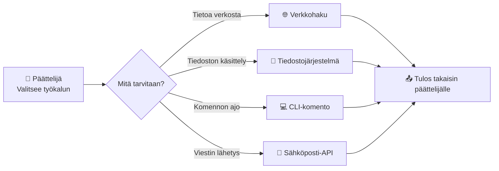

# Agentin työkalut — tiedostot, haku ja komennot

## Johdanto

Agentti näkee ja muistaa. Mutta miksi se on tehokkaampi kuin yksinkertainen chatbot? Koska se voi tehdä todellisia asioita. Se ei vain vastaa — se toimii.

Chatbot vastaa kysymykseen "Mikä on tuottomme hinta?" ja sanoo: "Se on 50 euroa." Agentti ei vain vastaa — se hakee tuotteen nykyisen hinnan tietokannasta, tarkistaa varastotason API:sta, vertaa hintaa kilpailijoihin ja vastaa: "Tuotteemme hinta on 50 euroa, ja meillä on 15 kappaa varastossa. Kilpailijoiden hinta on 55 euroa, joten olemme kilpailijoita halvempia." Agentti käytti **työkaluja** — tietokantahakua, API-kutsuja, laskentaa — tehdäkseen vastauksestaan paremman ja tarkemman.

Tässä oppitunnissa opit kolmea perustyökalua, joita agentti käyttää. Nämä kolme muodostavat perustan — kaikkien muiden työkalujen rakentavat näiden päälle. Ja kun rakennat agenttia n8n:llä, nämä kolme ovat ensimmäiset integraatiot, joita asetat.

## Työkalu 1: Tiedostot — lukeminen ja kirjoittaminen

Agentti voi lukea ja kirjoittaa tiedostoja. Tämä on yksinkertainen, mutta tehokas työkalu, koska se antaa agentille pääsyn pysyvään dataan.

Kun agentti **lukee tiedostoja**, se näkee maailman datan kautta. Se saattaa lukea raportteja PDF-muodossa, tietolistoja CSV-muodossa, konfiguraatiotiedostoja JSON-muodossa tai lokeja tekstitiedostoina. Nämä tiedostot antavat agentille informaation siitä, mitä maailmassa tapahtuu. IT-agentti voi lukea palvelimen lokeja ja löytää virheen, joka tapahtui klo 15.30 — se näkee muistilokilta, että palvelimen prosessi kaatui. Seuraavalla kerralla kun asiakas kysyy "Miksi palvelini oli alas?", agentti osaa vastata.

Kun agentti **kirjoittaa tiedostoja**, se vaikuttaa maailmaan. Se voi kirjoittaa raportteja, omia lokiaan toiminnoistaan tai tiedostoja, joita muut ohjelmat lukevat. Myyntiagentti voisi kirjoittaa CSV-tiedoston, joka sisältää listan kaikista uusista asiakkaista — tiedoston, jonka Excel avaa. Tekninen agentti voisi kirjoittaa uuden konfiguraatiotiedoston, jonka palvelin lukee ja soveltaa automaattisesti.

Mutta tiedostojen käsittely tuo mukanaan **kriittisen turvallisuuskysymyksen**: mitä oikeuksia agentti saa? Voiko se lukea, kirjoittaa ja poistaa tiedostoja missä tahansa, vai rajoitetaanko se tiettyihin kansioihin?

Jos agentti saa liian paljon oikeuksia, se voi vahingossa poistaa tärkeitä tiedostoja ja aiheuttaa todellista vahinkoa. Kuvittele agenttia, joka sekoittaa päätään ja ajaa Linux-komennon `rm -rf /`, joka poistaa koko järjestelmän. Jos agentti saa liian vähän oikeuksia, se ei voi tehdä sille annettua tehtävää. Tasapainon löytäminen on ammattilaisen työtä.

Käytännössä tämä tarkoittaa: agentti saa **kirjoitusoikeuden vain tiettyyn kansioon** — esimerkiksi `/reports/` — kun se kirjoittaa raportteja. Se saa **lukuoikeuden asiakastiedostoihin**, mutta ei kirjoitusoikeutta, koska se ei saa muuttaa asiakastietoja vahingossa. Se ei saa mitään oikeuksia **palkkajärjestelmän tiedostoihin**, koska se ei saa koskea palkkahallinnon dataan.

**Pysähdy hetkeksi: Jos agentti voi kirjoittaa tiedostoihin, mitkä tiedostot olisivat liian herkkiä sen käsiteltäviksi? Entä mitkä tiedostot voivat aiheuttaa vahinkoa, jos agentti muuttaa niitä virheellisesti?**

## Työkalu 2: Verkkohaku — internetin datalle pääsy

Agentti voi hakea tietoa internetistä. Tämä antaa sille pääsyn ajankohtaiseen tietoon, joka on muuttunut sen kouluttamisen jälkeen.

Ilman verkkohakua agentilla on käytössään vain tiedot, jotka sen koulutuksessa olivat. Jos koulutusdata on vuodelta 2023 ja nyt on 2026, agentin tieto on vanhaa. Osakkeiden hinnat muuttuvat sekunnissa — jos agentti ei hae niitä verkosta, se antaa vanhaa hintaa. Samoin uutiset. Jos asiakkas kysyy "Mitä tapahtui tänään?", ilman verkkohakua agentti ei voi vastata.

Verkkohaku tekee agentista ajankohtaisen ja **relevantin**. Kun asiakas kysyy osakkeen hinnasta, agentti hakee sen verkosta ja antaa tämän päivän hinnan. Kun asiakas haluaa tietää tämän päivän uutiset, agentti etsii ne. Kun asiakas kysyy Windows-päivityksistä, agentti löytää uusimmat ohjeet — ei vanhat, joita sen koulutuksessa oli.

Mutta verkkohaku tuo mukanaan **kolme merkittävää riskiä**.

Ensimmäinen on **väärä tieto**. Haku voi löytää valheita tai harhaanjohtavia sivustoja. Jos agentti etsii "parhaita lääkkeitä migreenihin" ja sattuu löytämään harhaanjohtavan sivuston, se voi jakaa vaarallista neuvoa. Ammattilaisena sinun täytyy **rajoittaa lähteitä**. Agentti saa hakea vain virallisista, tarkistetuista lähteistä — hallituksen terveysviranomaiselta, eikä satunnaisilta blogeista.

Toinen riski on **kustannukset**. Jotkut hakupalvelut laskuttavat jokaisesta hausta. Jos agentti ei ole rajoitettu, se voi vahingossa aiheuttaa kalliita kyselykustannuksia. Kuvittele: agentti tekee 100 hakua tunnissa, joista jokainen maksaa 10 senttiä. Kahden päivän kuluttua lasku on tuhansia euroja.

Kolmas riski on **yksityisyys ja turvallisuus**. Agentti voisi alkaa hakea liian herkkiä tietoja ilman rajoituksia. Asiakas voisi epäillä, että agentti etsii hänen henkilötunnuksensa verkon kautta — mikä olisi turvallisuusrisiko.

Ammattilaisena sinun täytyy asettaa **selkeät rajat hakutyökalulle**. Sanot agentille, miltä sivustoilta se saa hakea — **whitelist-malli**. Kiellät sen hakemasta henkilökohtaisia tai yksityisiä tietoja. Rajoitat, kuinka monta kertaa se voi hakea yhtä käyttäjän pyyntöä kohden. Nämä rajaukset suojaavat sekä agentin tekemiltä virheiltä että mahdollisilta hyökkäyksiltä.

**Pysähdy hetkeksi: Kuvittele agentti, jota käytät asiakaspalvelun tukena. Mitä tietoa sen ei pitäisi hakea verkosta turvallisuussyistä? Entä jos asiakas yrittää saada agentin hakemaan hänen salasanaansa?**

## Työkalu 3: CLI-komennot — palvelinilla toimiminen

CLI (Command Line Interface) tarkoittaa kykyä ajaa palvelinkomentoja. Tämä on voimakkain työkalu, mutta myös vaarallisin.

CLI antaa agentille kykyä **luoda ja poistaa kansioita, käynnistää ohjelmia ja muokata asetuksia**. Se voi suorittaa `mkdir /backup` luodakseen varmuuskopioiden kansion. Se voi ajaa `python analyze_sales.py` -analysointiskriptin, joka käsittelee myyntidataa minuutissa, samalla kun se normaalisti ottaisi tunteja. Se voi ajaa `systemctl restart apache2` -komentoa käynnistääkseen webpalvelimen uudelleen, jos se on kadonnut. CLI on tehokas työkalu, koska agentti voi tehdä todellisia, syvällisiä asioita palvelimella.

Mutta CLI on myös vaarallinen. Jos agentti voi ajaa mitä tahansa komentoja rajoittamattomasti, se voi vahingossa poistaa kaikki tiedostot komennolla `rm -rf /`. Se voi sammuttaa palvelimen. Se voi muuttaa konfiguraatioita niin pahasti, että järjestelmä hajoaa kokonaan. Yksi virhepäätös voi tuhota viikkojen työn. Turvallisuustutkijat näkevät CLI-pääsyn yhtenä vaarallisimmista agentteihin liittyvistä asioista.

Siksi sinun täytyy asettaa **tiukat rajat**. Yksi strategia on **whitelist** — luettelo komennoista, joita agentti saa ajaa. Agentti voi ajaa `ls` (näytä tiedostot), `mkdir` (luo kansio) ja `cp` (kopioi tiedosto), mutta ei `rm` (poista), ei `shutdown`, ei `chmod` (muuta oikeuksia). Whitelist on tiukka, mutta turvallinen.

Toinen strategia on **toimintorajoitus**: agentti voi lukea ja luoda, mutta ei poistaa mitään. Kolmas strategia on **ajaa hiekkalaatikossa** — eristetyssä ympäristössä, josta agentti ei voi vaikuttaa oikeaan järjestelmään. Neljäs strategia on **hyväksynnät**: agentti voi ehdottaa komentoa, mutta ihminen täytyy vahvistaa sen ennen suorittamista.

Yhdistämällä näitä strategioita voit antaa agentille tarpeeksi valtaa tehdä työtä, mutta suojautua siltä, että se tekee vahinkoa.

## Orkestraattori: työkalut järjestyksessä

Tähän asti olemme puhuneet työkaluista ikään kuin ne olisivat erillisiä. Mutta todellisuudessa agentti ei ole yksi iso neuroverkko, joka tekee kaiken. Agentti on **orkestraattori** — koordinaattori, joka kutsuu eri työkaluja järjestyksessä.

Orkesterissa kapellimestari ei soita jokaista instrumenttia. Hän ohjaa: "Viulunsoittajat, teidän vuoronanne." Kun heidän osionsa on valmis, hän sanoo: "Puhaltajat, teidän vuoronanne." Jokainen muusikko on erikoistunut omaan instrumenttiinsa, ja kapellimestari koordinoi heidän toimintaansa, jotta syntyy yhtenäinen sinfonia. Orkestri on vahvempi kuin yksittäinen muusikko.

Agentti toimii samalla tavalla. Se kutsuu työkaluja järjestyksessä. "Tiedostolukija, lue myyntitiedot.csv." Kun lukija on valmis, agentti sanoo: "Verkkohakija, etsi markkinatrendejä." Kun hakija on palauttanut tulokset, agentti sanoo: "Analyysityökalu, analysoi nämä luvut." Jokainen työkalu tekee sen, mitä se osaa parhaiten, ja agentti yhdistää tulokset kokonaisuudeksi.

**Orkestraattorille tarvitaan ohjeita** — strategiat tai "suunnittelumallit" siitä, miten kutsua työkaluja järjestyksessä. Nämä perustuvat tutkimukseen siitä, kuinka ihmiset ratkovat monimutkaisia ongelmia. Kaksi tärkeintä mallia tulevat seuraavaan oppituntiin — **ReAct** ja **chain-of-thought**. Mutta ymmärrä nyt, että agentti ei käytä kaikkia työkaluja samanaikaisesti. Se käyttää niitä järjestyksessä, perustuen siihen, mitä pitää tehdä seuraavaksi.

## Työkalut n8n:ssä — konkreettinen kartoitus

Kun rakennat agenttia oppitunneilla 26–27, nämä abstraktit työkalut muuttuvat konkreettisiksi n8n-solmuiksi. Tässä kartoitus, joka auttaa sinua yhdistämään teorian käytäntöön:

| Työkalu (teoria) | n8n-solmu (käytäntö) | Esimerkki |
|---|---|---|
| Tiedoston luku | **Read Files** -solmu tai **Google Sheets** -solmu | Agentti lukee myyntiraportin CSV-tiedostosta |
| Tiedoston kirjoitus | **Write File** -solmu tai **Google Sheets** -solmu | Agentti kirjoittaa analyysitulokset tiedostoon |
| Verkkohaku | **HTTP Request** -solmu tai **Google Search** -solmu | Agentti hakee tuotteen hinnan kilpailijan sivulta |
| CLI-komento | **Execute Command** -solmu (hiekkalaatikossa) | Agentti ajaa skriptin, joka analysoi lokitiedostoja |
| Sähköposti | **Gmail** / **SMTP** -solmu | Agentti lähettää vastauksen asiakkaalle |
| Tietokantahaku | **MySQL** / **PostgreSQL** -solmu | Agentti tarkistaa asiakkaan tilaushistorian |

Turvakerrokset, joita opit tässä oppitunnissa — whitelist, toimintorajoitus, hiekkalaatikko, hyväksynnät — toteutetaan n8n:ssä **IF-solmuilla** (ehtojen tarkistus), **erillisillä työnkuluilla** (hiekkalaatikko) ja **hyväksyntäsolmuilla** (ihminen tarkistaa ennen suoritusta). Tämä konkretisoituu oppitunneilla 26–27, mutta jo nyt sinun kannattaa ajatella: "Mikä n8n-solmu toteuttaisi tämän?"

## Käytännön esimerkki: analytiikka-agentti työvaiheissa

Kuvittele agenttia, joka analysoi myyntidataa yrityksen johtajalle. Näet, kuinka kolme työkalua toimivat yhdessä.

Ensin agentti lukee tiedostoja. Se avaa `myyntitiedot_2026.csv` -tiedoston, joka sisältää kuukausittaiset myyntiluvut: "Tammikuu: 50 000 €, Helmikuu: 52 000 €, Maaliskuu: 48 000 €." Tämä on aineisto, jonka analyysi pohjautuu.

Sitten agentti hakee verkosta kontekstia. Se etsii markkinatrendejä: "Teknologiasektori kasvoi 8 % viime vuotta vastaavaan aikaan verrattuna." Se hakee kilpailijatietoa: "Kilpailijamme laski 5 %." Se hakee asiakaspalautetta: "Asiakkaat mainitsevat tuotteiden saatavuuden parannuksena." Tämä verkosta löytämä konteksti auttaa agenttia ymmärtämään: onko 4 % lasku huono vai odotettava markkinakehityksessä?

Viimeksi agentti tekee työn CLI:n kautta. Se ajaa analyysiskriptin: `python analyze_sales.py`. Skripti käsittelee dataa ja tuottaa kuvia: myyntikäyriä, trendianalyysia ja ennusteita. Sitten agentti kirjoittaa tulokset tiedostoon — raportin, joka sisältää yhteenvedon, kaaviot ja johtopäätökset. Se siirtää valmiin raportin kansioon komennolla `mv raportti.txt /reports/myyntiraportti_2026_Q1.txt`.

Nämä kolme työkalua yhdessä muodostavat toimivan prosessin: ensin se lukee dataa tiedostoista, sitten etsii kontekstia verkosta, sitten tekee työn CLI:llä ja lopulta kirjoittaa tulokset takaisin tiedostoiksi. Jokainen työkalu syöttää seuraavalle.

## Riskinhallinta — jokainen työkalu vaatii rajoituksia

Kolme työkalua — tiedostot, verkkohaku, CLI — ovat voimakkaita. Mutta voima tuo mukanaan vastuun. Ammattilaisena sinun täytyy **suunnitella rajoitukset kullekin työkalulle** ennen kuin annat agentin käyttää sitä.

**Tiedostotyökalulle**: anna lukuoikeus vain välttämättömiin tiedostoihin. Anna kirjoitusoikeus vain erityisiin kansioihin. Älä anna poistooikeutta ollenkaan, ellei se ole kriittinen. Loggaa jokainen tiedoston avaus ja muokkaus, jotta näet myöhemmin, mitä agentti teki.

**Verkkohakutyökalulle**: määritä whitelist lähteistä. Rajoita kuinka monta hakua agenti voi tehdä sekunnissa tai päivässä. Estä haku henkilökohtaisista tai arkaluontoisista termeistä. Kirjaa jokainen haku, jotta näet, mitä agentti etsi.

**CLI-työkalulle**: käytä tiukkaa whitelistiä komennoista. Tai ajaa agentin CLI-operaatiot hiekkalaatikossa, erillään oikeista palvelimista. Vaadi ihmisen hyväksyntä kriittisille operaatioille (poisto, palvelimen sammutus). Loggaa jokainen suoritettu komento.

Näillä rajoituksilla agentti pysyy turvassa — se voi tehdä työtään, mutta ei voi tehdä katastrofaalista vahinkoa.

## Kohti omaa projektia

Tämän oppitunnin työkaluajattelu auttaa sinua hahmottamaan, mitä konkreettisia toimintoja oma agenttisi tarvitsee. Mieti omaa projektiasi: tarvitseeko agenttisi lukea tiedostoja, hakea tietoa verkosta vai suorittaa komentoja? Miten rajaat työkalut niin, että agentti pääsee käsiksi vain siihen, mitä se todella tarvitsee? Taulukko, jossa yhdistät abstraktit työkalut konkreettisiin n8n-solmuihin, on hyvä lähtökohta rakentamiselle.

## Yhteenveto

Agentti näkee ja muistaa, mutta voima tulee siihen, että se voi **tehdä todellisia asioita**. Kolme perustyökalua — **tiedostot, verkkohaku ja CLI-komennot** — antavat agentille kykyä toimia maailmassa. Agentti ei ole yksi iso älykäs ohjelma, vaan **orkestraattori**, joka kutsuu näitä työkaluja järjestyksessä tehtävän ratkaisemiseksi. Mutta jokainen työkalu tuo mukanaan turvallisuusriskit, jotka täytyy hallita rajoituksilla. Tiedostojen käytössä käy tiedostooikeuksista. Verkkohaussa määrität lähdewhitelistin. CLI-komennoissa käytät whitelist-malleja tai hiekkalaatikkoja. Kun rakennat agenttia n8n:llä seuraavissa oppitunneissa, nämä kolme ovat ensimmäiset integraatiot, jotka kytket agentin rinnalle — ja jokaisen kanssa sinun täytyy miettiä, mitä rajoituksia se tarvitsee.
