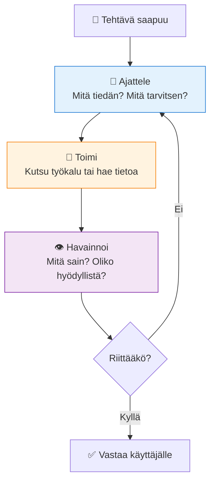
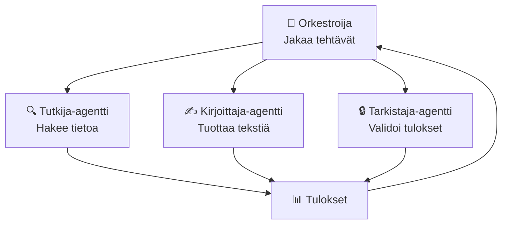
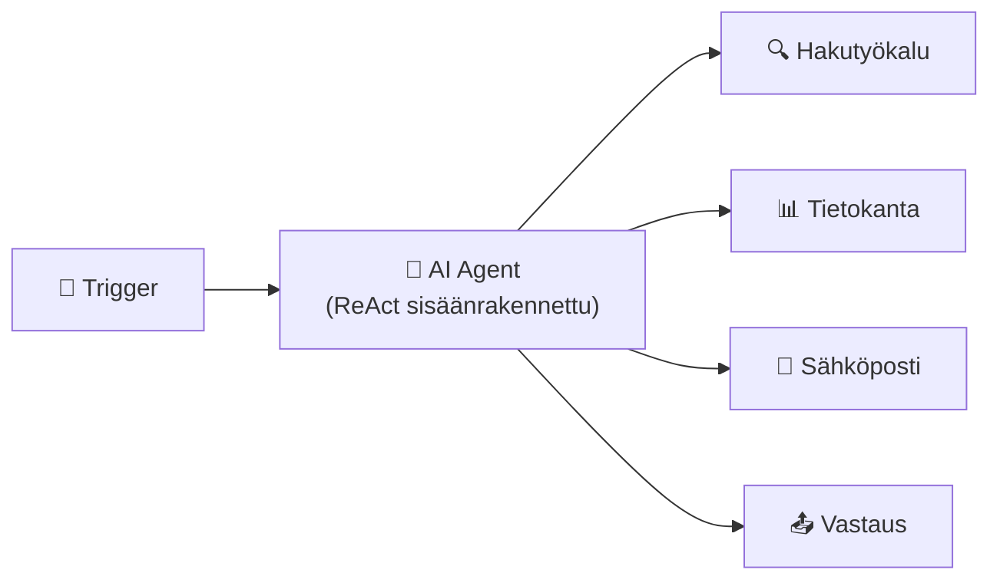
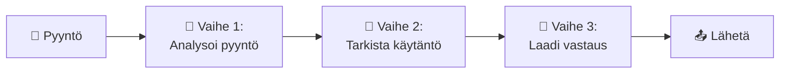

# Suunnittelumallit — ReAct, ketjuajattelu ja orkestrointi

## Johdanto

Nyt tiedät, mistä agentti koostuu — muistista, työkaluista, identiteetistä. Mutta kuinka saat agentin **ajattelemaan oikein**? Kuinka varmistan, että se tekee asiat järkevässä järjestyksessä, eikä hyppää sattumalta vääriin johtopäätöksiin?

Vastaus on **suunnittelumallit** (design patterns). Nämä ovat testattuja strategioita siitä, kuinka agentti ajattelee ja toimii. Ne perustuvat siihen, **kuinka ihmiset ratkovat monimutkaisia ongelmia**. Kun opit nämä mallit, voit neuvoa agenttia ajattelemaan kuten osaava asiantuntija — perustelemaan jokaisen askeleen, jakamaan ongelman osiin ja koordinoimaan tiiminsä.

Seuraavassa projektissa käytät näitä malleja. Sinä päätät, käyttääkö agentti ReActia vai ketjuajattelua, rakentaatko sen yksittäiseksi vai moniagenttisysteemiksi. Nämä päätökset tekevät agentista tehokkaan tai hidas.

## ReAct: ajattele, sitten toimi, sitten ajattele uudelleen

ReAct tarkoittaa **Reasoning + Acting** — agentti vuorottelee ajattelun ja toiminnan välillä. Se ei hyppää suoraan toimintaan. Sen sijaan se ajattelee ensin, sitten toimii, sitten ajattelee uudelleen tuloksen perusteella.

Käytännössä se näyttää tältä. Agentti saa tehtävän: "Asiakas kysyy, onko tuotetta saatavilla." Agentti ei heti kulje varasto-API:a. Ensimmäinen vaihe on **ajattelu**: "Asiakkaan kysymys on selkeä. Minun täytyy tarkistaa varasto. Kutsun varasto-API:a." Tämä ajattelu äännetään ääneen (loggiin), jotta näet, mitä agentti on päätellyt.

Sitten **toiminta**: agentti kutsuu varasto-API:a ja saa vastauksen: "Tuotetta on 5 kappaa."

Sitten **ajattelu uudelleen**: "Varasto sanoo, että tuotetta on 5 kappaa. Asiakas voi ostaa. Minulla on nyt riittävä tieto vastata." Agentti perustelee, mitä seuraava askel on.

Lopuksi **toinen toiminta**: agentti kirjoittaa vastauksen: "Kyllä, meillä on 5 kappaletta varastossa. Voitko tilata nyt?" Ajattelu ja toiminta vuorottelevat, kunnes tehtävä on valmis.

ReAct on tehokas, koska agentti perustelee jokaisen askeleensa ennen kuin tekee mitään. Se ei hyppää suoraan toimintaan. Se sanoo ensin, miksi se tekee sen. Tämä tekee agentin päätöksistä **ymmärrettävämpiä** ja **pienemmän todennäköisyyden virheisiin**.



Kun loggaat ReActia, näet selvästi agentin ajattelun ja toiminnan:

```
[AJATTELU] Asiakkaan kysymys koskee tuotteen hintaa. Minun täytyy hakea se tietokannasta.
[TOIMINTA] GET /api/product?id=12345 -> Hinta: 45€
[AJATTELU] Tietokanta antoi hinnan. Minulla on nyt vastaus.
[TOIMINTA] Lähetä vastaus: "Tuotteen hinta on 45€."
```

Näet jokaisen vaiheet ja voit ymmärtää, mitä agentti ajatteli. Jos jokin menee pieleen, näet tasan missä ajattelussa tai toiminnassa vika oli.

> **Pysähdy hetkeksi:** Ajattele omaa ratkaisuprosessiasi. Kun ratkaiset ongelmaa, ajatteletko ensin, sitten toimit, sitten ajattelet tuloksen perusteella? Vai hyppäätkö suoraan toimintaan? Mitä ReAct-malli voisi auttaa sinua tekemään paremmin?

## Ketjuajattelu: jaa ongelma osiin

Ketjuajattelumallissa (chain-of-thought) agentti purkaa monimutkaisen ongelman pienempiin osiin ja käsittelee ne järjestyksessä. Se käyttää **numeroitua listaa**: ensin tämä, sitten tuo, sitten tämä.

Esimerkiksi agentti saa tehtävän: "Käsittele palautuspyyntö." Agentti ei yritä ratkaista kaikkea yhdessä. Sen sijaan se purkaa ongelman:

**1. Vaihe**: "Mikä on asiakkaan ongelma? Tilauksesta puuttuu kolme tuotetta."

**2. Vaihe**: "Onko palautusaika voimassa? Tilaus tehtiin 5 päivää sitten, palautusaika on 14 päivää, eli kyllä."

**3. Vaihe**: "Mitä palautus vaatii? Palautuslomakkeen ja kuljetusohjeet."

**4. Vaihe**: "Onko asiakas oikeutettu hyvitykseen vai korvaavaan tuotteeseen? Tarkista yrityksen palautuskäytäntö. Käytäntö sanoo: ensimmäinen palautus saa hyvityksen."

**5. Vaihe**: "Mitä asiakkaalle lähetetään? Kirje, jossa selitetään prosessi, linkit palautuslomakkeelle ja kuljetusohjeet."

Ketjuajattelu auttaa agenttia **välttämään virheitä**, koska se pakottaa agentin käsittelemään yhden asian kerrallaan. Se ei yritä ratkaista kaikkea yhdellä hypyllä. Se on systemaattinen ja **jäljitettävä** — ihminen voi nähdä jokaisen vaiheen ja ymmärtää, miksi agentti teki mitä teki.

Vertaa näitä kahta strategiaa:

**Ilman ketjuajattelua**: Agentti näkee palautuspyynnön ja hyppää suoraan: "Lähetan hyvityksen." Mutta mitä jos palautusaika oli kulunut? Mitä jos käytäntö sanoo "korvaa tuotteella, älä anna hyvitystä"? Agentti tekee väärän päätöksen, koska se ei käynyt läpi vaihetta vaiheelta.

**Ketjuajattelun kanssa**: Agentti käy läpi jokaisen vaiheen. Se tarkistaa palautusajan. Se tarkistaa käytännön. Se tarkistaa, mistä tuotteista on kyse. Vasta sitten se tekee päätöksen. Virheet vähenevät.

## Moniagenttijärjestelmät: kun yksi agentti ei riitä

Tähän asti olemme puhuneet yksittäisestä agentista. Mutta monimutkaisissa tehtävissä yksi agentti ei välttämättä riitä. Silloin rakennetaan **moniagenttijärjestelmä**, jossa useat erikoistuneet agentit tekevät yhteistyötä.

Ajattele yritystä. Yksi ihminen ei hoida kaikkea — on myyjä, joka ymmärtää asiakkaat, kirjanpitäjä, joka hallinnoi rahaa, varastotyöntekijä, joka hoitaa logistiikkaa, ja johtaja, joka koordinoi kaikkea. Jokainen on erikoistunut omaan alueeseen. Moniagenttijärjestelmässä jokaisella agentilla on oma erikoisalansa.

Kuvittele asiakaspalvelun moniagenttisysteemia:

- **Analyysi-agentti** lukee asiakkaan viestin: "Asiakas on tyytymätön kuljetuspalveluun."
- **Tiedonhaku-agentti** hakee asiakkaan historian: "Tämä asiakas on ostanut meiltä 5 kertaa. Hän on lojaali. Hän on aiemmin ollut tyytymätön kuljetuspalveluihin."
- **Kirjoitus-agentti** laatii vastauksen: "Anteeksi kuljetus-ongelmaasi. Tarjoan sinulle ilmaisen kotiintulon seuraavassa tilauksessa."
- **Validointi-agentti** tarkistaa vastauksen: "Kyllä, vastaus on turvallinen. Se ei sisällä salattuja tietoja."

Moniagenttijärjestelmässä on kaksi perusrakennetta.

**Hierarkkinen malli**: Yksi agentti toimii johtajana ja jakaa tehtäviä muille. Johtaja-agentti näkee kokonaistehtävän ja päättää: "Tämä tehtävä vaatii tietokantahaun — lähetän sen hakuagentille. Kun hakuagentti on valmis, lähetän tuloksen kirjoittaja-agentille." Johtaja on orkesterin kapellimestari. Ohjaaja koordinoi, muut tekevät spesialistityönsä.



**Yhteistyömalli**: Agentit keskustelevat keskenään ilman johtajaa. Ensimmäinen agentti aloittaa, toinen vastaanottaa ja tekee seuraavan askeleen, kolmas tarkistaa, neljäs antaa palautetta. Ne vaihtavat tietoa keskenään ja tekevät yhteisiä päätöksiä.

Moniagenttijärjestelmät ovat voimakkaita, koska ne voivat jakaa monimutkaisen työn osiin. Jokainen agentti tekee sitä, mitä se osaa parhaiten. Mutta ne ovat myös monimutkaisia. Mitä enemmän agentteja on, sitä vaikeampaa on ymmärtää, mitä järjestelmässä tapahtuu. Agentti A sanoo agentille B jotain, agentti B tekee päätöksen ja sanoo agentille C jotain, agentti C tekee jotain, mikä vaikuttaa agentin A:n päätöksiin — ketjureaktio. Siksi **lokitus ja seuranta** ovat erityisen tärkeitä, kun agentteja on useita.

> **Pysähdy hetkeksi:** Ajattele todellista, monimutkaista tehtävää. Esimerkiksi asiakkaan uuden tilauksen käsittely: validointi, maksu, varasto, kuljetus, asiakaspalvelu. Miten jakaisit sen useamman erikoistuneen agentin kesken? Mikä agentti olisi johtaja? Mitä tietoa ne vaihtaisivat keskenään?

## Suunnittelumallien valinta: milloin käytät mitä?

Sinulla on nyt kolme välinettä: ReAct, ketjuajattelu ja moniagenttijärjestelmät. Milloin käytät mitä?

**ReActia käytetään**, kun agentti tarvitsee joustoa. Se ei ole liian jäykkä eikä liian vankka. Agentti voi ajatella, toimia, nähdä tuloksen ja muuttaa suunnaltaan, jos tulokset näyttävät odottamattomilta. Se on hyvä **tutkivalle ajattelulle** — kun agentti ei täsmälleen tiedä, mitä tapahtuu seuraavaksi, vaan sen on ajateltava vaihetta vaiheelta.

**Ketjuajattelua käytetään**, kun ongelma on **jakautuva pieniksi palasiksi** ja vaiheet ovat selvät. Palautuspyynnön käsittely on hyvä esimerkki — vaiheet ovat aina samat: tarkista aika, tarkista käytäntö, laadi vastaus. Ketjuajattelu pakottaa agentin käymään läpi jokaisen vaiheen, mikä estää virheitä.

**Moniagenttijärjestelmiä käytetään**, kun tehtävä on **niin monimutkainen, että se vaatii eri erikoisaloja**. Asiakaspalvelupyynnön käsittely saattaa vaatia analyysia, tiedonhakua, kirjoittamista ja validointia. Jokaisen tehtävän antaa spesialistille, joka on siihen erikoistunut.

Käytännössä usein käytät **yhdistelmää**. Esimerkiksi moniagenttijärjestelmä, jossa jokainen agentti käyttää **ReActia** omalla alueellaan ja harjannut­johtaja käyttää **ketjuajattelua** koordinoidakseen prosessin. Mallit eivät ole toisiaan poissulkevia — ne täydentävät toisensa.

## Esimerkki käytännössä: koodaustiimi moniagenttijärjestelmänä

Kuvittele koodaustiimin työtä ja kuinka se muistuttaa moniagenttijärjestelmää käyttävää agenttia.

Tiimin jäsen 1 (Analyysi) lukee vaatimukset: "Asiakkaan pitää pystyä lataamaan raportteja PDF-muodossa."

Tiimin jäsen 2 (Kehitys) kirjoittaa koodin: "Voin tehdä PDF-kirjoitustoiminnon käyttämällä avoimen lähdekoodin kirjastoa."

Tiimin jäsen 3 (Testaus) tarkistaa koodin: "Testasin sitä 10 eri raportin muodolla, ja se toimii 9/10 kerralla."

Tiimin jäsen 4 (Johtaja) näkee tilanteen: "Testaus löysi virheen. Lähetän sen takaisin kehittäjälle."

Tiimin jäsen 2 (Kehitys) korjaa koodin.

Tiimin jäsen 3 (Testaus) testaa uudelleen: "Nyt se toimii 10/10 kerralla."

Tiimin jäsen 4 (Johtaja) päättelee: "Valmis. Julkaistaan."

Tämä on moniagenttijärjestelmä toiminnassa. Jokainen erikoistunut osansa, johtaja koordinoi, ja lopputulos on parempi kuin yksittäinen kehittäjä olisi voinut tehdä.

## Suunnittelumallit n8n:ssä — miltä ne näyttävät käytännössä?

Kun rakennat n8n:ssä, on hyödyllistä ymmärtää, miten nämä abstraktit mallit muuttuvat konkreettisiksi työnkuluiksi.

**ReAct n8n:ssä**: AI Agent -solmu, jolla on pääsy useisiin työkaluihin. N8n:n AI Agent -solmu toimii luonnostaan ReAct-periaatteella — se ajattelee, valitsee työkalun, saa tuloksen, ajattelee uudelleen ja valitsee seuraavan työkalun. Sinun ei tarvitse rakentaa silmukkaa käsin — se on sisäänrakennettu.



**Ketjuajattelu n8n:ssä**: Sarja erillisiä solmuja, joista jokainen tekee yhden askeleen. Edellisen solmun tulos menee seuraavalle. Tämä on n8n:n luonnollisin rakenne — solmut ketjussa.



**Moniagentti n8n:ssä**: Useita erillisiä työnkulkuja, jotka kutsuvat toisiaan. "Johtaja"-työnkulku lähettää webhookin "tutkija"-työnkululle, saa tuloksen ja lähettää sen "kirjoittaja"-työnkululle. Tämä on monimutkaisin rakenne, mutta tehokkain monimutkaisiin tehtäviin.

Kun avaat n8n:n ensimmäistä kertaa, palaa tähän kappaleeseen. Se auttaa sinua valitsemaan oikean rakenteen projektillesi.

## Kohti omaa projektia

Nyt kun tunnet ReAct-mallin, ketjuajattelun ja moniagenttijärjestelmät, valitse omalle agentillesi sopivin päättelymalli. Mieti ongelmasi luonnetta: tarvitseeko agenttisi reagoida reaaliaikaisesti työkalujen palautteeseen (ReAct) vai voiko sen pilkkoa ongelman selkeisiin vaiheisiin (ketjuajattelu)? Tämä valinta on projektin aihio 3, jonka kirjoitat opiskelutehtävissä. Se vaikuttaa suoraan siihen, miten rakennat n8n-työnkulun oppitunnilla 26.

## Yhteenveto

Agentti on näennäisesti älykkäämpi, kun se ajattelee **järjestelmällisesti**. **ReAct-malli** auttaa agenttia ajattelemaan, toimimaan ja ajattelemaan uudelleen — joustavasti. **Ketjuajattelu** auttaa sitä purkamaan ongelmia ja käsittelemään ne järjestyksessä — vakaasti. **Moniagenttijärjestelmät** antavat agentille kykyä jakaa työn erikoistuneiden osien kesken. Nämä mallit perustuvat siihen, kuinka ihmiset ajattelevat ja työskentelevät. Kun rakennat agenttia n8n:llä, sinä valitset, mitä mallia agentti noudattaa. Valinta tekee agentista tehokkaan tai epätehokkaan, ymmärrettävän tai sekavan. Valitse aina malli, joka vastaa tehtävän luontoon.
