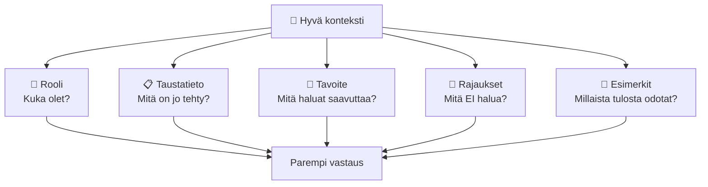

# Konteksti ja promptaus — miten puhut tekoälylle

## Johdanto

Kuvittele, että olet IT-tukihenkilö ja saat sähköpostissa viestin: "Tietokone ei toimi." Se on maininta, mutta mitä se tarkoittaa? Onko kyse verkkovirheestä? Eikö käyttöjärjestelmä käynnisty? Kaatuuko ohjelma? Eikö näyttö syttyy? Sama koskee tekoälyä. Jos sanot vain "auta minua", saat yleisen, ehkä hyödyttömän vastauksen. Mutta jos kerrot "olen IT-opiskelija, tarvitsen apua Linux-palvelimen SSH-ongelmaan, virhe on 'connection refused', yritän ottaa yhteyttä osoitteeseen 192.168.1.100:22" — silloin tekoäly ymmärtää, mikä on todellinen ongelma, ja voi antaa konkreettista apua. Tämä ero on *konteksti ja promptaus* — ja se on kaiken tekoälyviestinnän ydin.

Tämän tunnin jälkeen sinulla on neljäs todistusaineisto: konteksti ei ole pieni asia — se on kaiken tekoälyviestinnän perusta, ja promptaus on se taito, jolla kysyt oikein.

## Osa 1: Mitä konteksti on

Konteksti on kokonaisuus kaikkea sitä tietoa, jota tekoäly tarvitsee ymmärtääkseen, mitä sinä todella kysyt ja mitä haluat. Se ei ole vain yksittäinen kysymys tai käsky. Konteksti koostuu useista osista: kuka olet (roolisi), mitä taustaa sinulla on, mitä haluamme saavuttaa (tavoite), mitkä ovat rajat ja rajoitukset sekä konkreettiset esimerkit siitä, millaista vastausta odotat.

Kun opettaja neuvoo sinua matematiikan ongelmassa, hän ei vain kuule kysymystä — hän tietää, että olet 15-vuotias opiskelija, että olet oppinut derivaatat, että analysoit nyt funktion nollakohtia ja että hän haluaa sinun oppivan prosessin, ei vain saavasi vastausta. Kaikki tämä konteksti auttaa opettajaa antamaan juuri oikeanlaisen selityksen. Tekoäly tarvitsee saman.

> **Pysähdy hetkeksi:** Muista viimeksi, kun kysyit jotain internetistä tai ChatGPT:ltä ja sait täysin väärän tai hyödyttömän vastauksen. Mikä tieto puuttui? Mitkä tiedot olisivat auttaneet?

### Kontekstin viisi komponenttia

Hyvä konteksti rakentuu viidestä pääosasta.

**1. Rooli** — Keitä olemme, mikä on ammattitaitomme ja näkökulmamme. Jos kerrot "olen ammattitaitoinen C++-ohjelmoija", tekoäly tietää, että se voi käyttää tekniikkasuomea ja olettaa tietyn osaamistason. Jos sanot "olen IT-aloittelija", vastaus voi olla perusteellisempi ja helpommin hyödynnettävä.

**2. Taustatieto** — Mitä on jo tehty, mitä olemme oppineet ja mitkä ovat lähtökohdat. Kun yrität korjata ohjelmaa, jossa sinulla oli virhe aiemmin, kerro siitä. Kun analysoit tietokantaa, jota olet jo käyttänyt kuukausia, mainitse, mitä jo tiedät sen rakenteesta.

**3. Tavoite** — Miksi kysyt, mitä haluat tehdä ja mihin käytät vastausta. "Anna minulle lista pilvipalveluista" on eri asia kuin "valitse parhaat pilvipalvelut startup-yritykselle, jolla on budjetti 500 euroa kuukaudessa ja joka tarvitsee SQL-tietokannan." Tavoitteen selventäminen muuttaa vastausta merkittävästi.

**4. Rajaukset** — Mitä et halua, mikä ei ole olennaista ja mitkä asiat on jätettävä pois. "Selitä pilvipalvelut, mutta älä mainitse AWS:ää, koska tiedämme siitä jo." Tai "En halua filosofista vastausta, vain käytännön neuvoja."

**5. Esimerkit** — Näytä mallia siitä, mitä haluat. Jos haluat, että tekoäly kirjoittaa koodin dokumentaatiota samalla tyylillä kuin sinä, anna näyte aiemmin kirjoittamastasi dokumentaatiosta. Jos haluat koodia, joka noudattaa tiettyä rakennetta tai suunnittelutapaa, näytä esimerkki.

> **Pysähdy hetkeksi:** Ajattele tehtävää, jota teet usein ohjelmoinnissa — esimerkiksi "kirjoita funktio, joka käsittelee käyttäjän syötteen". Mitkä viidestä kontekstin osasta olisivat tärkeimpiä tässä tapauksessa? Miksi?

## Osa 2: Promptaus — kuinka kysyt

Kun konteksti on valmis, sinun on osattava muotoilla *prompti* — tehtävänanto, joka esitetään kontekstin puitteissa. Prompti on kysymys, joka rakentuu kontekstin pohjalle. Konteksti on pohja, jonka päälle prompti rakentuu.

Monella on tästä väärinkäsitys: he ajattelevat, että "hyvä prompti" on sama asia kuin "hyvä konteksti". Se on kuin sanoisi, että reseptin otsikko ("Pastakeitto") olisi sama kuin koko resepti – ainesosat, valmistusohjeet, käsittelylämpötila ja kypsennysajat. Prompti on *kysymys* tai *tehtävänanto*, jonka esität nyt. Konteksti on *kaikki muu*, joka tekee kysymyksestä ymmärrettävän ja vastauksesta hyödyllisen.

Kuvittele, että istut opettajan kanssa hänen työhuoneessaan ja kysyt matematiikan kysymystä. Opettaja on jo nähnyt aiemmat työsi, tietää, mistä olet epävarma, tuntee tavoitteesi (läpäisy vai erinomainen arvosana) ja tietää, mitä olet jo oppinut. Kaikki tämä on *konteksti*. Sitten esität *promptin*: "Kuinka ratkaiset nollakohdan?" Prompti on kysymys, mutta konteksti on kaikki se muu, joka tekee kysymyksestä ymmärrettävän ja vastauksesta hyödyllisen.

### Hyvän promptin viisi elementtiä

Hyvä prompt rakentuu viidestä osasta. Et tarvitse niitä kaikkia joka promptiin, mutta tieto siitä, mitä osia voit käyttää, tekee sinusta paremman käyttäjän.

**1. Tavoite (goal)** — Mitä haluat? "Kirjoita tämä", "Selitä tämä", "Paranna tämä". Tavoite on selkeä lause, joka kertoo, mitä tekoäly tekee.

**2. Rooli (role)** — Kuka tekoäly on? "Olet Python-kehittäjä", "Olet opettaja", "Olet tietoturva-asiantuntija". Rooli auttaa mallia omaksumaan oikean näkökulman ja sopivan kielen.

**3. Rajat (constraints)** — Mitä EI tehdä? "Älä käytä monimutkaisia SQL-kyselyitä", "Kirjoita enintään 3 lausetta", "Älä mainitse hintoja". Rajat antavat mallille selkeän toiminta-alueen.

**4. Outputformaatti (format)** — Miten haluat vastauksen? "Vastaa JSON-muodossa", "Kirjoita taulukko", "Anna vaihekohtaiset ohjeet". Formaatti varmistaa, että saat käyttökelpoisen tuloksen.

**5. Esimerkit (examples)** — Näytä yksittäinen esimerkki siitä, mitä haluat. "Esimerkiksi: INPUT: 'terve', OUTPUT: 'Terve! Kuinka voin auttaa?'". Esimerkit tekevät vaatimuksista konkreettisempia.

Ammattilaisesti nämä viisi elementtiä ovat perustyökalusarjasi. Mitä enemmän tietoja annat, sitä parempia vastauksia saat.

> **Pysähdy hetkeksi:** Ajattele viimeistä kertaa, kun kysyit ChatGPT:ltä jotain. Mitkä viidestä elementistä annoit? Mitä puuttui? Olisiko parempi vastaus ollut mahdollinen, jos olisit antanut puuttuvat elementit?

## Osa 3: Konteksti ja promptaus yhteensä

Seuraavassa konkreettinen esimerkki, joka näyttää, kuinka konteksti ja promptaus toimivat yhdessä.

### Huono esimerkki: ilman kontekstia ja heikolla promptilla

**Prompt:** "Kirjoita funktio, joka validoi sähköpostiosoitteen."

Miksi se on huono? Koska se ei sisällä:
- Roolia: Oletko kehittäjä? Opettaja?
- Taustaa: Mitä olet jo yrittänyt?
- Tavoitetta: Miksi tarvitset validaatiota?
- Rajausta: Kuinka tiukka validaatio on? Hyväksytkö "+"-merkin?
- Esimerkkejä: Mikä on "oikea" osoite? Mikä "väärä"?

Tekoäly tekee oletuksia joka kohdassa ja antaa sinulle jonkin version, joka *saattaa* sopia tarpeisiisi.

### Hyvä esimerkki: selkeä konteksti ja terävä prompti

**Konteksti:**
- Rooli: Olen IT-opiskelija ja aloittelija Python-koodauksessa.
- Taustatieto: Kirjoitimme verkon rekisteröitymislomakkeen ja tarvitsemme validaatiota sähköpostikentälle.
- Tavoite: Haluan luoda funktion, joka tarkistaa, onko sähköposti kelvollinen muodossa name@domain.com.
- Rajaukset: En halua käyttää kompleksista regex-kirjastoa, vaan yksinkertaista logiikkaa.
- Esimerkit: Hyväksy "student@example.com", hylkää "student @example.com" (välilyönti).

**Prompti:**
"Kirjoita Python-funktio nimeltä `validate_email()`, joka ottaa merkkijonon ja palauttaa True, jos se on muodossa name@domain.com, False muuten. Käytä yksinkertaista logiikkaa ilman regex-kirjastoa. Lisää kommentit. Esimerkki: validate_email('test@example.com') palauttaa True, validate_email('test @example.com') palauttaa False."

Miksi se on hyvä?
- Rooli: Python-opiskelija — malli tietää kontekstin ja osaamistason.
- Tavoite: "kirjoita funktio" — selkeä.
- Rajat: "yksinkertainen logiikka", "kommentit" — tarkka.
- Formaatti: "Python-funktio" — malli tietää muotoilun.
- Esimerkit: Kaksi tapausta — mikä hyväksytään, mikä hylätään.

Ammattilaisesti hyvä konteksti ja prompti säästävät aikaa. Joudut ehkä käyttämään enemmän aikaa kontekstin ja promptin muotoiluun, mutta saat parempia tuloksia ja tarvitset vähemmän kierroksia.

## Osa 4: Miksi huono konteksti ja prompti tuottaa huonoa jälkeä

Kun konteksti ja prompti ovat epäselviä, tekoäly joutuu arvailemaan. Se yrittää täydentää puuttuvat tiedot omilla oletuksillaan. Oletukset ovat usein vääriä.

**Esimerkki:** Jos kysyt "kuinka järjestelmöidään palvelin", tekoäly voi ajatella, että olet Windows-käyttäjä, Linux-asiantuntija tai aloittelija — jokainen oletus johtaa eri vastaukseen. Jos jaat koodikatkelman ilman kontekstia, tekoäly voi ehdottaa ratkaisuja, joita et pysty toteuttamaan omassa ympäristössäsi.

Huonon kontekstin ja promptin seurauksena saat usein myös liian pitkiä tai hajanaisia vastauksia. Tekoäly ei tiedä, mihin vastaus pitäisi kohdistaa, joten se kirjoittaa kaiken, mitä tietää. Jos kerrot selvästi "tarvitsen 5 minuutin opetusvideon käsikirjoituksen", saat ytimekkään vastauksen. Jos sanot vain "kirjoita video tekoälystä", saatat saada kahden tunnin esseen aiheesta.

Kontekstin ja promptin puuttuminen aiheuttaa myös turhauttavia väärinymmärryksiä. Opettaja tulkitsee "apua matikassa" eri tavoin riippuen siitä, oletko yläkoululainen vai yo-opiskelija. Tekoäly toimii samoin — ja ilman kontekstia ja selkeää promptia se valitsee usein aivan liian yleisen tai liian yksityiskohtaisen tason.

> **Pysähdy hetkeksi:** Mieti, millä tavoin antaisit itse kontekstia ja selkeän pyynnön ystävällesi, joka auttaa sinua IT-ongelmassa kasvotusten. Mitä kerrot ensin, mitä viimeiseksi?

## Osa 5: Iteratiivinen kontekstin ja promptin rakentaminen

Ammattilaisesti et yritä kertoa kaikkea yhdessä suuressa tekstissä. Sen sijaan rakennat kontekstia ja promptia kierros kierrokselta — ammattilaiset kutsuvat tätä "prompt engineeringiksi".

**Kierros 1 — PerusPrompt:**
"Kirjoita Python-funktio, joka validoi sähköpostiosoitteen."
- Saat: perusregex-funktion

**Kierros 2 — Lisää kontekstia:**
"Lisää tuki plus-osoitteisiin (test+tag@example.com). Lisää docstring."
- Saat: parannetun version

**Kierros 3 — Tarkenna tavoitetta:**
"Nyt kirjoita testit tälle funktiolle. Sisällytä vähintään 5 tapausta."
- Saat: testisuiten

**Kierros 4 — Muuta formaattia:**
"Muuta testit pytest-muotoon ja lisää seuraavat edge caset: osoite ilman TLD:tä, osoite yli 254 merkkiä."
- Saat: täydellisen testisuiten

Jokainen kierros rakentaa edellisen päälle. Tekoäly "muistaa" kontekstin jokaisessa kierroksessa (riippuen siitä, mitä mallia käytät ja siitä, onko kyse samasta sessiosta vai eri sessioista).

Ammattilaisesti tämä on tehokasta. Et yritä ennustaa kaikkea etukäteen. Teet iteratiivisesti, näet tulokset ja parannat. Tämä on parempi strategia kuin kirjoittaa kerralla yksi täydellinen suurprompti, koska:
- Näet tulokset välillä ja voit korjata kurssia.
- Voit antaa kontekstia vähitellen kun ymmärrät, mitä tarvitset.
- Tekoäly pysyy paremmin "kartalla" lyhyemmillä kierroksilla.

> **Pysähdy hetkeksi:** Miksi iteratiivinen kontekstin ja promptin rakentaminen olisi parempi kuin "kaiken kerralla" -lähestyminen? Mitä voisi ammattilaisesti mennä pieleen, jos yrität kertoa kaiken kerralla?

## Osa 6: Kontekstin rakentaminen käytännössä

Käytännössä kontekstin ja promptin rakentaminen alkaa siitä, että ymmärrät, mitä itse tarvitset. Ennen kuin avaat tekoälyn, kirjoita itsellesi lyhyesti: kuka olen, mitä teen, mikä on ongelmani, mitä tiedän jo, mitä haluan saavuttaa.

Kerro sitten nämä asiat tekoälylle — ei välttämättä muodollisesti, mutta selvästi.

**Esimerkki 1 — IT-ongelma:**
- Huono: "Koska tietokanta on hidas."
- Hyvä: "Olen IT-opiskelija, ja yritämme nopeuttaa SQL-tietokantaa. Taulukossa on noin 100 000 riviä, ja TOP-10-haku kestää nyt 3 sekuntia. Olemme jo lisänneet indeksin hakukenttään, mutta se ei auttanut. Tarvitsemme konkreettisia neuvoja, joita voimme testata omassa laboratorioympäristössämme."

**Esimerkki 2 — Ohjelmistovirhe:**
- Huono: "Ohjelmani ei toimi."
- Hyvä: "Olen kirjoittanut C++-ohjelman, joka lukee CSV-tiedostoa ja lajittelee tiedot. Kun tiedosto on pienempi kuin 1000 riviä, se toimii. Kun tiedosto on 10 000 riviä, ohjelma kaatuu segmentation faultiin. Olen käyttänyt vector-rakennetta tietojen tallentamiseen. Tarvitsen apua sen selvittämiseen, miksi muisti loppuu."

Nämä ovat silti lyhyitä, mutta ne sisältävät roolin, taustan, tavoitteen ja rajaukset. Ne tekevät tekoälyn vastauksesta hyödyllisemmän ja kohdennetumman.

## Yhteenveto

Konteksti ja promptaus ovat kaksi puolta samasta kolikosta. Konteksti on pohja — se rakentuu viidestä osasta: roolista, taustasta, tavoitteesta, rajauksista ja esimerkeistä. Promptaus on kysymys, joka esitetään kontekstin puitteissa, ja se rakentuu viidestä elementistä: tavoitteesta, roolista, rajauksista, outputformaatista ja esimerkeistä. Yhdessä ne muodostavat tehokkaan välineen, jolla saat tekoälystä juuri sellaista apua, jota tarvitset.

Ammattilaisesti et yritä antaa kaikkea yhdessä. Sen sijaan rakennat kontekstia ja promptia kierros kierrokselta. Joka kierros tarkentaa seuraavaa, ja lopputulos on moninkertaisesti parempi kuin yksi kerralla kirjoitettu täydellinen suurprompti.

Hyvä konteksti ja terävä prompti ovat investointi: ne vaativat hiukan enemmän aikaa ajatteluun ja kirjoittamiseen, mutta tuloksena on vastaus, joka on todella hyödyllinen eikä turha. Tämän kurssin ydinasia on, että konteksti ja prompti eivät ole pikkujuttu — ne ovat kaiken tekoälyviestinnän perusta. Konteksti- ja promptaus-taidot ovat IT-ammattilaiselle yhtä tärkeitä kuin ohjelmointikielten hallinta tai verkko-osaaminen.

Seuraavalla tunnilla syvennämme kontekstin hallintaan: ymmärrät, että tekoälyn muisti on rajallinen, ja opit hallitsemaan sitä.
