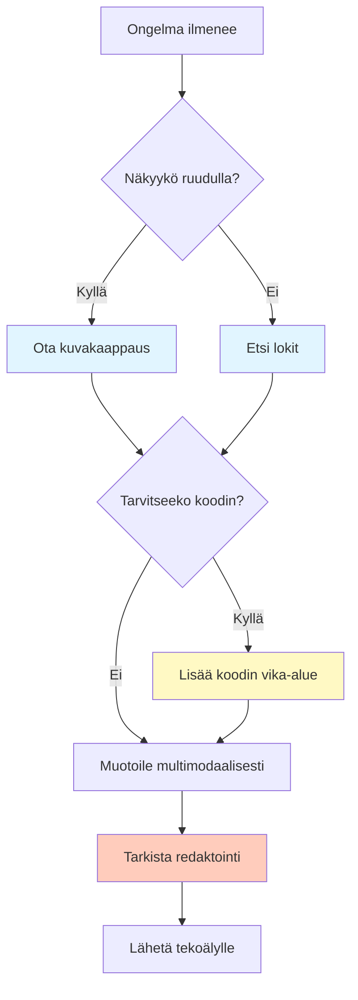

# Kuvat, ääni ja teksti — multimodaalinen ongelmanratkaisu

## Johdanto

Olet varmasti nähnyt IT-ammattilaisen ottavan kuvakaappauksen virheilmoituksesta ja lähettävän sen verkkofoorumille apua pyytäessään. Tai olet katsonut koodaria, joka sanoo: "Tässä on kuvakaappaus, jossa ongelma näkyy." Monille aloittelijoille kuvakaappaus on vain kuva – heidän mielestään vähemmän hyödyllinen kuin teksti. Ammattilaiselle kuvakaappaus, lokit ja dokumentit ovat kuitenkin kaikki kontekstia omassa muodossaan.

Tämän oppitunnin jälkeen ymmärrät, miksi näyttäminen on parempi kuin kertominen. Opit rakentamaan multimodaalista kontekstia — tekstiä, kuvia, lokeja ja koodia yhdessä — ja käyttämään sitä debuggaukseen ja ongelmanratkaisuun. Näet myös, kuinka tekoäly näkee ja kuulee enemmän kuin teksti — ja tämä tekee siitä paljon voimakkaamman.

## Mitä multimodaalisuus on

Multimodaalisuus tarkoittaa, että tekoälymallit voivat käsitellä erilaisia tietomuotoja – tekstiä, kuvia, koodia, ääntä ja videota. Ensimmäiset markkinoille tulleet kielimallit, kuten GPT-3, käsittelivät vain tekstiä. Modernit mallit, kuten nykymuotoinen ChatGPT, Microsoft Copilot tai Claude, puolestaan voivat 'nähdä' kuvia. Jotkin mallit voivat myös 'kuunnella' ääntä ja analysoida videoita.

Tämä avaa täysin uuden maailman kontekstille. Aiemmin ajateltiin näin: "Tietokannassa on virhe. Lokit ovat pitkät, enkä pysty hahmottamaan missä virhe on, koska teksti on niin pitkä." Nyt voidaan toimia toisin: "Otan kuvakaappauksen virheilmoituksesta ja lähetän sen tekoälylle." Aiemmin: "En voi näyttää käyttöliittymän bugia tekstin avulla." Nyt: "Otan kuvakaappauksen ja näytän tekoälylle tarkalleen, mitä näytyy."

Modaliteetti tarkoittaa tietomuotoa. Teksti on yksi modaliteetti, kuva toinen. Koodi on kolmas (vaikka se on teknisesti tekstiä, sillä on oma kontekstuaalinen merkityksensä). Lokit ovat neljäs. Kun käytät kahta tai useampaa modaliteettia yhdessä, sitä kutsutaan multimodaaliseksi. Käytännössä kaikki nykyiset chatpohjaiset kielimallit ovat multimodaalisia malleja.

Multimodaaliset mallit ovat myös työkaluina tehokkaampia, koska ne näkevät kuvakaappauksista suoraan mitä tarkoitat. Jos kirjoitat "ohjelma on hidas", tekoäly voi vain arvata, mitä koitat sanoa. Mutta jos näytät kuvakaappauksen, jossa näkyy prosessin käyttämä 99 % CPU:sta, tekoäly tietää tarkalleen, mikä tuo "ohjelma on hidas" -ongelma on.

> **Pysähdy hetkeksi:** Ajattele projektia, jota työstät nyt. Mitä muita tietomuotoja kuin tekstiä käytät päivittäin? (Kuvakaappauksia, lokitietoja, taulukoita, kaavioita?) Kuinka usein jätät ne pois, koska kuvittelet, että tekoäly ei voi käsitellä niitä?

## Kuvakaappaukset — näyttöä eikä kuvausta

Kuvakaappaus (screenshot) on ehkä tärkein yksittäinen kontekstityökalu IT-ammattilaisen arsenaalissa. Se näyttää tekoälylle tarkalleen, mitä näet. Virhe? Ota kuvakaappaus virheestä. UI-ongelma? Kuvakaappaus. Outo käyttöjärjestelmän käyttäytyminen? Kuvakaappaus.

Miksi kuvakaappaus on niin tehokas? Koska se poistaa arvailun. Kun sanot "Apache-palvelimen konfiguraatio on väärä", tekoäly voi arvata 20 erilaista virhettä. Mutta kun näytät kuvakaappauksen `httpd.conf`-tiedostosta, jossa näkyy `SSLEngine off` virheellisesti sijoitettuna, tekoäly näkee tarkalleen ongelman ja voi ehdottaa täsmällistä korjausta.

### Hyvän kuvakaappauksen tekeminen

Ammattilaisena otat kuvakaappauksia strategisesti:

1. **Älä lähetä koko ruutua**, ellei se ole olennaista. Zoomaa olennaiseen osaan.
2. **Osoita virheellistä kohtaa** (monet kuvakaappaustyökalut antavat sinulle nuolen tai värikehyksen).
3. **Kommentoi kuvakaappausta:** "Tässä on virhe — näet punaisella kirjoitetun viestin."
4. **Valitse oikea esitysmuoto:**
   - Voit lähettää koko ruudun kuvakaappauksen (hyvä, mutta se voi sisältää häiritsevää tietoa).
   - Voit ottaa kuvakaappauksen vain virheilmoituksesta (parempi, kohdennetumpi).
   - Voit ottaa kuvakaappauksen virheilmoituksesta ja muutamasta rivistä kontekstia (paras, koska se näyttää sekä virheen että sen taustan).

Modernit tekoälyt voivat lukea kuvakaappausta samalla tavalla kuin ihminen. Se näkee tekstin, värit, kuvakkeet ja asettelun. Jos virheviesti on punaisella, malli näkee sen punaisena ja tietää, että kyse on virheestä. Jos näytät lokin virheilmoituksia, malli voi lukea ne tarkasti.

> **Pysähdy hetkeksi:** Mieti viimeisintä IT-ongelmaa, johon kysyit apua. Olisiko kuvakaappaus ollut parempi konteksti kuin tekstikuvaus? Miten tekoäly olisi voinut auttaa paremmin?

## Lokitiedostot — järjestelmän puheenvuoro

Lokit (logs) ovat tietue kaikesta, mitä järjestelmä tekee. Kun ohjelmassa on virhe, lokit kertovat, mikä meni pieleen ja milloin.

Monesti opiskelijat sanovat: "Minulla on virhe, mutta en tiedä, mikä se on." Ensimmäinen asia, jota ammattilainen kysyy, on: "Mitä lokit kertovat?" Tämä johtuu siitä, että lokit ovat usein ihmisen luettavissa:

```
2024-03-14 10:23:45 ERROR: Failed to connect to database at localhost:5432
2024-03-14 10:23:45 ERROR: Connection timeout after 5 seconds
2024-03-14 10:23:46 WARNING: Retrying connection attempt 2 of 3
```

Kun annat lokit tekoälylle, se voi lukea rivit ja sanoa: "Näen, että tietokanta ei ole saatavilla — portti 5432 ei vastaa."

### Lokien tyypit

Lokit voivat tulla useista lähteistä:

- **Sovelluksen lokit:** mitä koodisi tekee — funktioiden kutsut, tietojen käsittely, ratkaisujen hakeminen
- **Järjestelmän lokit:** mitä käyttöjärjestelmä tekee — muistin käyttö, prosessit, laitteet
- **Verkkolokit:** mitä palvelin tekee — HTTP-pyynnöt, yhteydet, bandwidthin käyttö
- **Virhelokit (stderr):** mitä ohjelma sanoo virheen yhteydessä — poikkeukset, kaatumiset, varoitukset

### Lokien valitseminen kontekstiksi

Kun käytät tekoälyä, älä lähetä 5000 riviä lokia. Suodata oleelliset osiot:

1. **Etsi virhe tai varoitus** lokista.
2. **Merkitse oleelliset rivit** — viimeiset 20 riviä, grep-tulokset tai kuvakaappaus.
3. **Lisää konteksti:** "Ohjelma kaatui kello 10:45. Näetkö syyn näissä logeissa?"

Tekoäly voi sitten etsiä virheilmoituksia, tutkia ajoitusta ja ehdottaa ratkaisuja.

> **Pysähdy hetkeksi:** Missä sovelluksessa tai järjestelmässä olet nähnyt lokeja? Mitä sellaista lokeista voidaan oppia, mitä et näkisi muuten?

## Koodi ja konfiguraatiotiedostot — rakenteen näyttäminen

Monesti ongelma on itse koodissa. Ehkä skripti ei toimi, konfiguraatiotiedosto on väärä tai Python-funktio tekee outoja asioita.

### Koodin antaminen kontekstiksi

Kun annat tekoälylle koodia, se voi analysoida sen:

```python
def calculate_discount(price, discount_percent):
    return price - (price * discount_percent)
```

"Näetkö tässä ongelmaa? Kun discount_percent on 0.1 (10 %), tulos on oikea. Mutta kun se on 1 (100 %), hinta muuttuu negatiiviseksi. Pitäisikö lisätä tarkistus?"

Kun annat koodia, on kolme tärkeää asiaa:

1. **Konteksti:** Mikä ohjelma on kyseessä? Mikä ohjelmointikieli?
2. **Vika-alue:** Mitkä rivit ovat ongelmallisia? (muutama kymmenen riviä, ei 500)
3. **Käyttäytyminen:** Mitä haluat tapahtuvan? Mitä todellisuudessa tapahtuu?

### Konfiguraatiotiedostot

Konfiguraatiotiedostot voivat myös aiheuttaa ongelmia:

```json
{
  "database": {
    "host": "localhost",
    "port": 5432,
    "user": "admin",
    "password": "admin123"
  }
}
```

"Tässä on konfiguraatiotiedosto. Näetkö siinä turvallisuusongelman? Salasana on kovakoodattu."

Tekoäly voi lukea sekä tekstiä että kuvakaappauksia koodista, mutta usein teksti on parempi, koska tekoäly voi muokata sitä suoraan.

## Turvallisuus — redaktointi ja yksityisyys

**Tärkeä huomio: älä koskaan näytä salasanoja, API-avaimia tai muita salaisuuksia tekoälylle.** Jos kuvakaappaus tai lokit sisältävät näitä, poista ne ennen jakamista.

### Salaisuuksien redaktointi

- **Salasanakenttä:** Näytä `[REDACTED]` tai `***`
- **API-avain:** Näytä `sk-***...xyz` (ensimmäinen ja viimeinen merkit, muu peitetty)
- **Tunnus (token):** Näytä `jti_12345...abcdef`
- **Luottokorttinumero:** Näytä `****-****-****-6789`
- **Käyttäjätunnus:** Näytä `user_123...` (vain osa)

Jos lokit sisältävät käyttäjätietoja tai asiakkaita koskevia tietoja, poista ne tai anonymisoi ne kokonaan.

### Miksi turvallisuus on pakollista

Turvallisuus ei ole valinnainen — se on ammattilaiselle pakollista. Tämä suojaa sekä sinua että muita:
- Estää salaisuuksien vuotamisen tekoälykumppanien palvelimille
- Suojaa muita käyttäjiä, joiden tiedot saattavat olla logeissa
- Ylläpitää luottamusta organisaatiossasi

> **Pysähdy hetkeksi:** Ajattele IT-järjestelmää, jossa käyttäjät voivat nähdä toistensa tietoja. Mitä turvallisuusriskejä olisi, jos jakaisit lokit tekoälylle muokkaamatta niitä?

## Yhdistäminen — multimodaalinen konteksti käytännössä

Ammattilaiselle paras ongelmanratkaisu yhdistää kaikki nämä elementit:

**Tekstin, kuvakaappausten, lokien ja koodin yhdistäminen:**

"Tässä on kuvakaappaus virheilmoituksesta. Tässä ovat lokin viimeiset 20 riviä. Ja tässä on koodin vika-alue (rivit 45–55). Yritin päivittää käyttäjän profiilin, mutta validointi epäonnistuu. Kunkin kentän pitäisi hyväksyä vain tietyntyyppistä dataa, mutta validointi epäonnistuu myös oikealla datalla."

Nyt tekoälylla on:
- Visuaalinen konteksti (kuvakaappaus)
- Ajoituksen ja ympäristön konteksti (lokit)
- Koodin konteksti (vika-alue)
- Käyttäytymisen konteksti (mitä haluat, mitä tapahtuu)

Tämä on paljon parempi kuin "Minulla on validointivirhe."

### Päätösten tekeminen: milloin käyttää mitäkin

Kuvakaappaukset ovat tehokkaat, mutta ne kuluttavat paljon tokeneita. Ammattilainen tekee päätöksiä strategisesti:

| Tilanne | Käytä kuvakaappausta? | Käytä tekstiä? | Käytä lokeja? |
|---------|----------------------|----------------|---------------|
| Käyttöliittymän bugi | ✅ Kyllä | Ei (redundantti) | Ei |
| Virheilmoitus näytöllä | ✅ Kyllä | Kyllä (konteksti) | Ehkä (jos pitkät) |
| Sovellus kaatui | ❓ Jos näkyy | ✅ Kyllä | ✅ Kyllä (kriittinen) |
| Koodin virhe | Ei | ✅ Kyllä (teksti on parempi) | Ehkä (runtime-virhe) |
| Verkko-ongelma | ❓ Ehkä | Kyllä | ✅ Kyllä (network logs) |
| Hidas sovellus | Kuvakaappaus | Kyllä (konteksti) | ✅ Kyllä (performance logs) |



## Monimodaalisten mallien rajoitukset

Multimodaaliset mallit ovat tehokkaita, mutta niillä on rajoituksia.

### 1. Kuvakaappaukset kuluttavat tokeneita

Yksittäinen kuva voi olla 10 000 tokenia, siinä missä teksti olisi ollut vain 1 000 tokenia. Tämä tyhjentää konteksti-ikkunaa nopeammin. Siksi käytät kuvakaappauksia strategisesti – vain kriittisiin asioihin, et kaikkeen.

### 2. Tarkkuusrajoitukset

Tekoäly voi lukea kuvakaappauksia, mutta se voi tehdä virheitä:
- Pieniä fontteja voi olla vaikea lukea
- Sekalaiset taustat voivat tehdä tekstistä epäselvää
- Monimutkainen käyttöliittymä voi hämmentää mallia

Siksi kuvakaappaus yhdessä tekstin kanssa on usein parempi kuin kuvakaappaus yksin.

### 3. Mallin kyvyt vaihtelevat

Kaikki tekoälymallit eivät ole multimodaalisia. Vanhat mallit, jotkin erikoistuneet mallit ja halvemmat mallit näkevät vain tekstiä. Siksi sinun täytyy tietää, mitä mallia käytät.

Ammattilaisena tiedät mallin kyvyt ja käytät sitä järkevästi:
- Jos malli on multimodaalinen, hyödynnät kuvakaappauksia
- Jos se ei ole, kuvailet ongelmat tekstinä
- Vaihdat mallien välillä tarpeen mukaan – joskus pieni tekstimalli on nopeampi, joskus suuri multimodaalinen malli on parempi

## Multimodaalisuus käytännössä

Käytännössä ammattilaisena noudatat tätä työnkulkua:

1. **Ongelma syntyy** → ota kuvakaappaus
2. **Lokit kertovat virheistä** → suodata ja näytä tekstinä
3. **Koodia täytyy muokata** → näytä tekstinä
4. **Rakenne täytyy nähdä** → kuvakaappaus tai taulukko
5. **Ennen jakamista** → tarkista redaktointi

### Käytännön työkalut

- **Kuvakaappaustyökalu:** Asenna hyvä kuvakaappaussovellus (esim. Snagit, ShareX tai käytä Windowsin sisäänrakennettua Snipping Tool -sovellusta). Zoomaa olennaiseen ja lisää nuolia tai tekstiä halutessasi.

- **Lokien suodatus:** Kun jaat lokeja, älä lähetä 5 000 riviä. Suodata olennaiset virheet (viimeiset 20 riviä tai grep-tulokset).

- **Strukturoidut tiedot:** Kielimallit rakastavat rakenteista tietoa — CSV-muotoista dataa, JSON-tietueita, markdown-taulukoita.

- **Koodin näyte:** Näytä vain oleellisin osa koodista tekstinä (muutama kymmenen riviä). Kuvakaappaus koodista on harvoin niin hyödyllinen.

## Yhteenveto

Multimodaalisuus on IT-ammattilaisen avain kontekstin hallintaan ja ongelmanratkaisuun. Kun tekoäly voi nähdä kuvia, logia ja koodia, se ymmärtää ongelman paremmin ja antaa parempia ratkaisuja.

Ammattilaisena:
- **Näytät ennen kuin kuvailet** — kuvakaappaukset poistavat tulkinnanvaraisuutta
- **Suodatat lokit** — näytät vain oleelliset rivit
- **Annat koodia tekstinä** — koska tekoäly voi muokata sitä
- **Yhdistät strategisesti** — teksti + kuva + lokit + koodi = täydellinen konteksti
- **Tarkistat turvallisuuden** — redaktoit salaisuudet ennen jakamista
- **Tiedät mallin kyvyt** — ja käytät oikeaa mallia oikeaan tehtävään

Näin tekoälystä tulee todella hyödyllinen työkaveri IT-työssä ja ongelmanratkaisussa.
